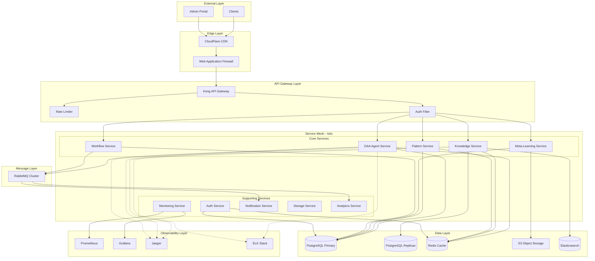
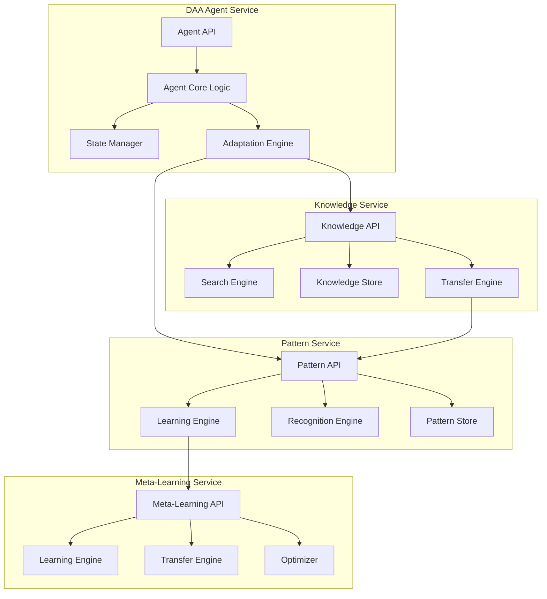
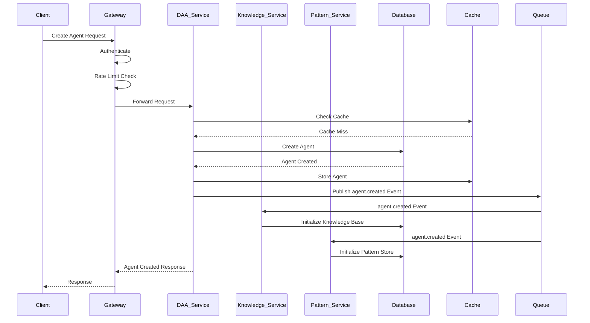
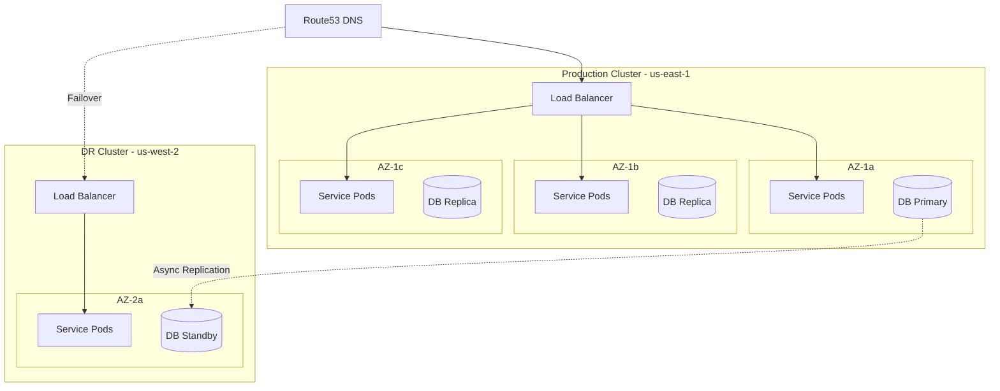

# 01. System Architecture

## Overview
Complete system architecture for the DAA (Decentralized Autonomous Agents) autonomous learning system, including component design, service topology, data flow patterns, and scalability architecture.

## Technical Requirements

### Architecture Components (REQ-T001 - REQ-T010)

**REQ-T001**: Microservices Architecture
**Priority**: CRITICAL
**Description**: System MUST be built as independently deployable microservices
**Rationale**: Enables independent scaling, deployment, and fault isolation
**Acceptance**: Each service can be deployed independently without affecting others

**REQ-T002**: Service Discovery
**Priority**: CRITICAL
**Description**: Services MUST auto-discover each other using service mesh
**Rationale**: Dynamic service location without hardcoded endpoints
**Acceptance**: Services can find each other automatically in Kubernetes cluster

**REQ-T003**: API Gateway
**Priority**: HIGH
**Description**: Single entry point for all external API requests
**Rationale**: Centralized routing, rate limiting, authentication
**Acceptance**: All external traffic routes through gateway

**REQ-T004**: Load Balancing
**Priority**: HIGH
**Description**: Automatic load distribution across service instances
**Rationale**: Even traffic distribution and high availability
**Acceptance**: Traffic distributed evenly across all healthy instances

**REQ-T005**: Circuit Breaker Pattern
**Priority**: HIGH
**Description**: Automatic failure detection and circuit breaking
**Rationale**: Prevent cascading failures across services
**Acceptance**: Failed services automatically isolated within 5 seconds

**REQ-T006**: Health Checks
**Priority**: CRITICAL
**Description**: Liveness and readiness probes for all services
**Rationale**: Automatic detection and recovery of unhealthy instances
**Acceptance**: Unhealthy instances removed from load balancer within 10s

**REQ-T007**: Graceful Shutdown
**Priority**: HIGH
**Description**: Services handle shutdown signals gracefully
**Rationale**: No request loss during deployments
**Acceptance**: All in-flight requests complete before shutdown

**REQ-T008**: Stateless Services
**Priority**: HIGH
**Description**: Services MUST NOT store state locally
**Rationale**: Enables horizontal scaling and instance replacement
**Acceptance**: Any instance can handle any request

**REQ-T009**: Idempotent Operations
**Priority**: HIGH
**Description**: API operations MUST be idempotent
**Rationale**: Safe retry logic and exactly-once semantics
**Acceptance**: Repeated identical requests produce same result

**REQ-T010**: Backward Compatibility
**Priority**: HIGH
**Description**: API changes MUST maintain backward compatibility
**Rationale**: Zero-downtime deployments with rolling updates
**Acceptance**: Old clients work with new service versions

### Service Topology (REQ-T011 - REQ-T020)

**REQ-T011**: DAA Agent Service
**Priority**: CRITICAL
**Description**: Core service for agent lifecycle management
**Components**: Agent creation, adaptation, workflow execution
**Acceptance**: Handles 1000 concurrent agent operations

**REQ-T012**: Knowledge Service
**Priority**: CRITICAL
**Description**: Knowledge sharing and retrieval service
**Components**: Knowledge storage, search, transfer
**Acceptance**: Sub-100ms knowledge retrieval at p95

**REQ-T013**: Pattern Service
**Priority**: CRITICAL
**Description**: Pattern learning and recognition service
**Components**: Pattern storage, analysis, cognitive patterns
**Acceptance**: Processes 500 pattern updates/second

**REQ-T014**: Meta-Learning Service
**Priority**: HIGH
**Description**: Cross-domain learning and transfer
**Components**: Meta-learning algorithms, domain transfer
**Acceptance**: Supports 10+ simultaneous learning domains

**REQ-T015**: Monitoring Service
**Priority**: HIGH
**Description**: Performance metrics and learning analytics
**Components**: Metrics collection, aggregation, alerting
**Acceptance**: Real-time metrics with <5s latency

**REQ-T016**: Workflow Service
**Priority**: HIGH
**Description**: Autonomous workflow orchestration
**Components**: Workflow definition, execution, coordination
**Acceptance**: Handles 100 concurrent workflows

**REQ-T017**: Auth Service
**Priority**: CRITICAL
**Description**: Authentication and authorization
**Components**: JWT issuance, token validation, RBAC
**Acceptance**: Token validation <10ms at p95

**REQ-T018**: Notification Service
**Priority**: MEDIUM
**Description**: Event notifications and alerts
**Components**: Email, webhook, real-time notifications
**Acceptance**: Delivers notifications within 30 seconds

**REQ-T019**: Storage Service
**Priority**: HIGH
**Description**: Object storage for artifacts and models
**Components**: File upload, retrieval, versioning
**Acceptance**: Handles files up to 1GB with streaming

**REQ-T020**: Analytics Service
**Priority**: MEDIUM
**Description**: Business intelligence and reporting
**Components**: Data aggregation, reporting, dashboards
**Acceptance**: Generates reports within 5 minutes

### Data Flow Architecture (REQ-T021 - REQ-T030)

**REQ-T021**: Event-Driven Communication
**Priority**: CRITICAL
**Description**: Services communicate via asynchronous events
**Rationale**: Decoupling, scalability, eventual consistency
**Acceptance**: Events delivered with at-least-once guarantee

**REQ-T022**: Message Queue Integration
**Priority**: CRITICAL
**Description**: RabbitMQ for event distribution
**Rationale**: Reliable message delivery and routing
**Acceptance**: Message delivery within 50ms at p95

**REQ-T023**: Event Sourcing
**Priority**: HIGH
**Description**: Critical state changes stored as events
**Rationale**: Complete audit trail and state reconstruction
**Acceptance**: All agent state changes recorded as events

**REQ-T024**: CQRS Pattern
**Priority**: HIGH
**Description**: Separate read/write models
**Rationale**: Optimized queries and command processing
**Acceptance**: Read queries don't impact write performance

**REQ-T025**: Saga Pattern
**Priority**: HIGH
**Description**: Distributed transactions via sagas
**Rationale**: Maintain consistency across services
**Acceptance**: Compensating transactions on failure

**REQ-T026**: Data Replication
**Priority**: HIGH
**Description**: Read replicas for query optimization
**Rationale**: Reduce read load on primary database
**Acceptance**: Replication lag <5 seconds

**REQ-T027**: Cache Strategy
**Priority**: HIGH
**Description**: Multi-layer caching (API, application, database)
**Rationale**: Reduce latency and database load
**Acceptance**: 80%+ cache hit rate for reads

**REQ-T028**: Stream Processing
**Priority**: MEDIUM
**Description**: Real-time event processing
**Rationale**: Immediate reactions to system events
**Acceptance**: Event processing <100ms latency

**REQ-T029**: Batch Processing
**Priority**: MEDIUM
**Description**: Scheduled batch jobs for analytics
**Rationale**: Resource-intensive operations off-peak
**Acceptance**: Batch jobs complete within SLA windows

**REQ-T030**: Data Partitioning
**Priority**: HIGH
**Description**: Horizontal partitioning by agent ID
**Rationale**: Distribute data across shards
**Acceptance**: Even distribution across partitions

### Scalability Architecture (REQ-T031 - REQ-T040)

**REQ-T031**: Horizontal Auto-Scaling
**Priority**: CRITICAL
**Description**: Automatic instance scaling based on metrics
**Triggers**: CPU >70%, Memory >80%, Request rate >1000/s
**Acceptance**: New instances launched within 60 seconds

**REQ-T032**: Database Connection Pooling
**Priority**: CRITICAL
**Description**: Shared connection pools to database
**Configuration**: Min 10, Max 100 connections per instance
**Acceptance**: No connection exhaustion under load

**REQ-T033**: Rate Limiting
**Priority**: HIGH
**Description**: API rate limits per user/IP
**Limits**: 100 req/min per user, 1000 req/min per IP
**Acceptance**: Rate limits enforced with 429 responses

**REQ-T034**: Bulkhead Pattern
**Priority**: HIGH
**Description**: Resource isolation between operations
**Rationale**: Prevent resource exhaustion
**Acceptance**: Slow endpoints don't affect fast ones

**REQ-T035**: Async Job Processing
**Priority**: HIGH
**Description**: Long-running tasks processed asynchronously
**Rationale**: Prevent request timeouts
**Acceptance**: Jobs queued and processed within SLA

**REQ-T036**: CDN Integration
**Priority**: MEDIUM
**Description**: Static assets served via CDN
**Rationale**: Reduce latency for global users
**Acceptance**: Assets served from edge locations

**REQ-T037**: Database Sharding
**Priority**: HIGH
**Description**: Horizontal database partitioning
**Strategy**: Hash-based sharding by agent_id
**Acceptance**: Queries route to correct shard

**REQ-T038**: Read-Write Splitting
**Priority**: HIGH
**Description**: Reads from replicas, writes to primary
**Rationale**: Distribute query load
**Acceptance**: Read queries use replicas

**REQ-T039**: Materialized Views
**Priority**: MEDIUM
**Description**: Pre-computed aggregations
**Rationale**: Fast complex queries
**Acceptance**: View refresh <5 minutes

**REQ-T040**: Resource Quotas
**Priority**: HIGH
**Description**: Per-service resource limits
**Configuration**: CPU, memory, storage quotas
**Acceptance**: Services can't exceed quotas

### Resilience Architecture (REQ-T041 - REQ-T050)

**REQ-T041**: Multi-AZ Deployment
**Priority**: CRITICAL
**Description**: Services deployed across availability zones
**Rationale**: Zone failure tolerance
**Acceptance**: Single zone failure doesn't impact availability

**REQ-T042**: Database Backups
**Priority**: CRITICAL
**Description**: Automated daily backups with PITR
**Retention**: 30 days, hourly snapshots
**Acceptance**: RPO <1 hour, RTO <2 hours

**REQ-T043**: Disaster Recovery
**Priority**: CRITICAL
**Description**: Multi-region failover capability
**RTO**: <1 hour, RPO: <5 minutes
**Acceptance**: Successful DR drills quarterly

**REQ-T044**: Retry Logic
**Priority**: HIGH
**Description**: Exponential backoff retries
**Configuration**: 3 retries, 2x backoff, 30s max
**Acceptance**: Transient failures automatically retried

**REQ-T045**: Timeout Configuration
**Priority**: HIGH
**Description**: Request timeouts at every layer
**Configuration**: API 30s, Database 10s, External 60s
**Acceptance**: No indefinite hangs

**REQ-T046**: Fallback Mechanisms
**Priority**: HIGH
**Description**: Degraded functionality on dependency failure
**Rationale**: Partial availability better than none
**Acceptance**: Core features work with degraded dependencies

**REQ-T047**: Chaos Engineering
**Priority**: MEDIUM
**Description**: Regular chaos experiments
**Rationale**: Validate resilience assumptions
**Acceptance**: Monthly chaos tests in staging

**REQ-T048**: Service Mesh
**Priority**: HIGH
**Description**: Istio service mesh for traffic management
**Features**: Retry, timeout, circuit breaker, mTLS
**Acceptance**: All inter-service traffic via mesh

**REQ-T049**: Observability
**Priority**: CRITICAL
**Description**: Comprehensive logging, metrics, tracing
**Stack**: Prometheus, Grafana, Jaeger, ELK
**Acceptance**: End-to-end request tracing

**REQ-T050**: Alert System
**Priority**: HIGH
**Description**: Automated alerting on anomalies
**Channels**: PagerDuty, Slack, Email
**Acceptance**: Critical alerts within 1 minute

## System Architecture Diagram

## Component Architecture Diagram

## Data Flow Diagram

## Deployment Architecture

## Technology Stack

### Core Technologies
| Component | Technology | Version | Rationale |
|-----------|-----------|---------|-----------|
| Runtime | Node.js | 18.x LTS | Performance, ecosystem |
| Language | TypeScript | 5.0+ | Type safety, tooling |
| Framework | NestJS | 10.0+ | Architecture, DI, testing |
| API | REST + GraphQL | OpenAPI 3.0 | Flexibility, standards |

### Data Layer
| Component | Technology | Version | Rationale |
|-----------|-----------|---------|-----------|
| Primary DB | PostgreSQL | 15+ | ACID, JSON, performance |
| Cache | Redis | 7+ | Speed, pub/sub, clustering |
| Search | Elasticsearch | 8+ | Full-text search, analytics |
| Storage | S3 Compatible | - | Object storage, durability |
| Queue | RabbitMQ | 3.12+ | Reliability, routing |

### Infrastructure
| Component | Technology | Version | Rationale |
|-----------|-----------|---------|-----------|
| Orchestration | Kubernetes | 1.28+ | Container orchestration |
| Service Mesh | Istio | 1.20+ | Traffic management, security |
| CI/CD | GitHub Actions | - | Automation, integration |
| IaC | Terraform | 1.6+ | Infrastructure as code |
| Monitoring | Prometheus/Grafana | - | Metrics, visualization |

## Performance Requirements

| Metric | Target | Measurement |
|--------|--------|-------------|
| API Response Time | p95 < 200ms | End-to-end latency |
| Database Query | p95 < 100ms | Query execution time |
| Event Processing | < 50ms | Queue to processing |
| Cache Hit Rate | > 80% | Cache effectiveness |
| Throughput | 10,000 req/s | Sustained load |
| Availability | 99.9% | Monthly uptime |

## Scalability Targets

| Dimension | Current | Target (6mo) | Target (1yr) |
|-----------|---------|--------------|--------------|
| Concurrent Users | 1,000 | 10,000 | 100,000 |
| Active Agents | 5,000 | 50,000 | 500,000 |
| Knowledge Items | 100K | 1M | 10M |
| Patterns | 10K | 100K | 1M |
| Events/Second | 1,000 | 10,000 | 100,000 |

## Security Architecture

- **Authentication**: JWT with RS256, OAuth2, MFA
- **Authorization**: RBAC with resource-level permissions
- **Encryption**: TLS 1.3 in-transit, AES-256 at-rest
- **Secrets**: HashiCorp Vault, Kubernetes secrets
- **Compliance**: GDPR, SOC2, ISO 27001 ready

## Next Steps

Technical specifications continue in:
- `02-api-design.md` - Complete API specifications
- `03-database-schema.md` - Database design
- `04-security-auth.md` - Security implementation
- `05-deployment-infrastructure.md` - Infrastructure details
- `06-integration-patterns.md` - Integration architecture

---

**Requirements**: REQ-T001 to REQ-T050 (50 requirements)
**Status**: ✅ Complete
**Version**: 1.0.0
**Last Updated**: 2025-11-27
