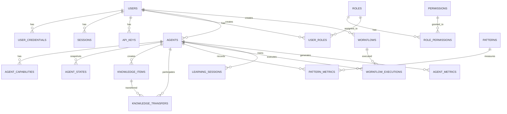

# 03. Database Schema

## Overview
Complete database schema design for the DAA autonomous learning system, including PostgreSQL tables, relationships, indexes, constraints, partitioning strategies, and migration plans.

## Technical Requirements

### Database Architecture (REQ-T101 - REQ-T110)

**REQ-T101**: PostgreSQL Primary Database
**Priority**: CRITICAL
**Version**: PostgreSQL 15+
**Features**: JSONB, partitioning, full-text search, UUID
**Acceptance**: All data in normalized tables

**REQ-T102**: Read Replicas
**Priority**: CRITICAL
**Configuration**: 3 replicas, async replication
**Lag**: <5 seconds replication lag
**Acceptance**: Read queries distributed to replicas

**REQ-T103**: Connection Pooling
**Priority**: CRITICAL
**Tool**: PgBouncer
**Configuration**: Min 10, Max 100 connections per instance
**Acceptance**: No connection exhaustion

**REQ-T104**: UUID Primary Keys
**Priority**: HIGH
**Type**: UUID v4
**Rationale**: Distributed ID generation, mergeability
**Acceptance**: All tables use UUID PKs

**REQ-T105**: Soft Deletes
**Priority**: HIGH
**Implementation**: deleted_at timestamp column
**Rationale**: Audit trail, recovery capability
**Acceptance**: DELETE sets deleted_at, queries filter NULL

**REQ-T106**: Audit Logging
**Priority**: HIGH
**Implementation**: Triggers on critical tables
**Storage**: Separate audit_logs table
**Acceptance**: All state changes logged

**REQ-T107**: Optimistic Locking
**Priority**: HIGH
**Implementation**: version column, increment on update
**Rationale**: Prevent lost updates
**Acceptance**: Concurrent updates detected

**REQ-T108**: Database Migrations
**Priority**: CRITICAL
**Tool**: TypeORM migrations
**Strategy**: Forward-only, versioned
**Acceptance**: Automated CI/CD migrations

**REQ-T109**: Backup Strategy
**Priority**: CRITICAL
**Schedule**: Daily full, hourly incremental
**Retention**: 30 days
**Acceptance**: RPO <1 hour, RTO <2 hours

**REQ-T110**: Point-in-Time Recovery
**Priority**: HIGH
**Implementation**: WAL archiving
**Retention**: 7 days
**Acceptance**: Restore to any point in time

### Core Entity Tables (REQ-T111 - REQ-T120)

**REQ-T111**: agents Table
**Priority**: CRITICAL
**Description**: Core agent entity storage
**Indexes**: id (PK), type, status, created_at
**Acceptance**: Sub-50ms lookups by ID

**REQ-T112**: agent_capabilities Table
**Priority**: HIGH
**Description**: Agent capability mappings
**Relationship**: Many-to-many with agents
**Acceptance**: Efficient capability queries

**REQ-T113**: agent_states Table
**Priority**: HIGH
**Description**: Agent state snapshots
**Partitioning**: By created_at (monthly)
**Acceptance**: State history queryable

**REQ-T114**: knowledge_items Table
**Priority**: CRITICAL
**Description**: Knowledge base storage
**Indexes**: id, domain, source_agent_id, full-text
**Acceptance**: Full-text search <200ms

**REQ-T115**: knowledge_transfers Table
**Priority**: HIGH
**Description**: Knowledge sharing events
**Relationship**: Links agents and knowledge
**Acceptance**: Transfer history tracked

**REQ-T116**: patterns Table
**Priority**: CRITICAL
**Description**: Learned pattern storage
**Storage**: JSONB for pattern_data
**Acceptance**: Pattern retrieval <100ms

**REQ-T117**: pattern_metrics Table
**Priority**: MEDIUM
**Description**: Pattern performance metrics
**Partitioning**: By created_at (monthly)
**Acceptance**: Time-series metrics

**REQ-T118**: workflows Table
**Priority**: HIGH
**Description**: Workflow definitions
**Storage**: JSONB for steps
**Acceptance**: Workflow queries <50ms

**REQ-T119**: workflow_executions Table
**Priority**: HIGH
**Description**: Workflow execution history
**Partitioning**: By started_at (weekly)
**Acceptance**: Execution tracking

**REQ-T120**: learning_sessions Table
**Priority**: MEDIUM
**Description**: Meta-learning session data
**Storage**: JSONB for session metrics
**Acceptance**: Session retrieval <100ms

### Authentication & Authorization Tables (REQ-T121 - REQ-T130)

**REQ-T121**: users Table
**Priority**: CRITICAL
**Description**: User accounts
**Indexes**: id, email (unique), status
**Acceptance**: User lookup <10ms

**REQ-T122**: user_credentials Table
**Priority**: CRITICAL
**Description**: Password hashes and MFA
**Security**: Separate table, encrypted at rest
**Acceptance**: Bcrypt with cost 12

**REQ-T123**: sessions Table
**Priority**: HIGH
**Description**: Active user sessions
**Storage**: Redis primary, PostgreSQL backup
**Acceptance**: Session lookup <5ms

**REQ-T124**: api_keys Table
**Priority**: HIGH
**Description**: API key management
**Security**: Hashed keys, scoped permissions
**Acceptance**: Key validation <10ms

**REQ-T125**: roles Table
**Priority**: HIGH
**Description**: Role definitions
**Hierarchy**: Support role inheritance
**Acceptance**: Role queries <5ms

**REQ-T126**: permissions Table
**Priority**: HIGH
**Description**: Permission definitions
**Format**: resource:action (e.g., agents:write)
**Acceptance**: Permission checks <5ms

**REQ-T127**: role_permissions Table
**Priority**: HIGH
**Description**: Role-permission mappings
**Relationship**: Many-to-many
**Acceptance**: Efficient permission lookups

**REQ-T128**: user_roles Table
**Priority**: HIGH
**Description**: User-role assignments
**Relationship**: Many-to-many
**Acceptance**: User permission resolution <10ms

**REQ-T129**: oauth_tokens Table
**Priority**: MEDIUM
**Description**: OAuth token storage
**Encryption**: Access tokens encrypted
**Acceptance**: Token validation <10ms

**REQ-T130**: mfa_devices Table
**Priority**: MEDIUM
**Description**: MFA device registration
**Types**: TOTP, SMS
**Acceptance**: MFA verification <50ms

### Monitoring & Analytics Tables (REQ-T131 - REQ-T140)

**REQ-T131**: agent_metrics Table
**Priority**: HIGH
**Description**: Agent performance metrics
**Partitioning**: By timestamp (daily)
**Acceptance**: Time-series ingestion 10k/sec

**REQ-T132**: knowledge_metrics Table
**Priority**: MEDIUM
**Description**: Knowledge usage analytics
**Partitioning**: By timestamp (daily)
**Acceptance**: Usage patterns queryable

**REQ-T133**: pattern_usage Table
**Priority**: MEDIUM
**Description**: Pattern application tracking
**Partitioning**: By timestamp (weekly)
**Acceptance**: Pattern effectiveness metrics

**REQ-T134**: system_metrics Table
**Priority**: HIGH
**Description**: System-wide performance metrics
**Retention**: 90 days raw, aggregated forever
**Acceptance**: Metrics dashboard <1s load

**REQ-T135**: audit_logs Table
**Priority**: CRITICAL
**Description**: Comprehensive audit trail
**Partitioning**: By created_at (monthly)
**Acceptance**: Immutable, tamper-evident

**REQ-T136**: error_logs Table
**Priority**: HIGH
**Description**: Application error logging
**Partitioning**: By timestamp (weekly)
**Acceptance**: Error analysis queryable

**REQ-T137**: api_requests Table
**Priority**: MEDIUM
**Description**: API request logging
**Partitioning**: By timestamp (daily)
**Acceptance**: Request analytics available

**REQ-T138**: webhook_deliveries Table
**Priority**: MEDIUM
**Description**: Webhook delivery tracking
**Retention**: 30 days
**Acceptance**: Delivery status trackable

**REQ-T139**: background_jobs Table
**Priority**: HIGH
**Description**: Async job queue
**Storage**: Job status and results
**Acceptance**: Job status queries <50ms

**REQ-T140**: notifications Table
**Priority**: MEDIUM
**Description**: User notifications
**Partitioning**: By created_at (monthly)
**Acceptance**: Notification retrieval <100ms

### Data Integrity & Constraints (REQ-T141 - REQ-T150)

**REQ-T141**: Foreign Key Constraints
**Priority**: CRITICAL
**Description**: All relationships enforced
**Cascade**: Defined cascade delete rules
**Acceptance**: Referential integrity maintained

**REQ-T142**: Check Constraints
**Priority**: HIGH
**Description**: Data validation at DB level
**Examples**: Status enums, score ranges
**Acceptance**: Invalid data rejected

**REQ-T143**: Unique Constraints
**Priority**: HIGH
**Description**: Uniqueness enforcement
**Examples**: User email, API key
**Acceptance**: Duplicate prevention

**REQ-T144**: Not Null Constraints
**Priority**: HIGH
**Description**: Required fields enforced
**Coverage**: All critical fields
**Acceptance**: NULL values prevented

**REQ-T145**: Default Values
**Priority**: MEDIUM
**Description**: Sensible column defaults
**Examples**: status='active', version=1
**Acceptance**: Defaults applied consistently

**REQ-T146**: Triggers
**Priority**: HIGH
**Description**: Automated data management
**Use Cases**: Audit logging, timestamps
**Acceptance**: Triggers fire consistently

**REQ-T147**: Stored Procedures
**Priority**: MEDIUM
**Description**: Complex operations in DB
**Use Cases**: Batch updates, analytics
**Acceptance**: Performance optimized

**REQ-T148**: Views
**Priority**: MEDIUM
**Description**: Pre-defined query views
**Use Cases**: Common joins, aggregations
**Acceptance**: View performance acceptable

**REQ-T149**: Materialized Views
**Priority**: HIGH
**Description**: Pre-computed aggregations
**Refresh**: Hourly or on-demand
**Acceptance**: Complex queries <100ms

**REQ-T150**: Database Encryption
**Priority**: CRITICAL
**Implementation**: Transparent Data Encryption (TDE)
**Coverage**: All data at rest
**Acceptance**: AES-256 encryption

## Database Schema

### Core Tables

```sql
-- Enable UUID extension
CREATE EXTENSION IF NOT EXISTS "uuid-ossp";
CREATE EXTENSION IF NOT EXISTS "pg_trgm"; -- For full-text search

-- Agents Table
CREATE TABLE agents (
    id UUID PRIMARY KEY DEFAULT uuid_generate_v4(),
    type VARCHAR(50) NOT NULL,
    status VARCHAR(20) NOT NULL DEFAULT 'active',
    cognitive_pattern VARCHAR(20) NOT NULL DEFAULT 'adaptive',
    learning_rate DECIMAL(3,2) CHECK (learning_rate >= 0 AND learning_rate <= 1),
    performance_score DECIMAL(3,2) CHECK (performance_score >= 0 AND performance_score <= 1),
    metadata JSONB DEFAULT '{}',
    version INTEGER NOT NULL DEFAULT 1,
    created_at TIMESTAMP NOT NULL DEFAULT CURRENT_TIMESTAMP,
    updated_at TIMESTAMP NOT NULL DEFAULT CURRENT_TIMESTAMP,
    deleted_at TIMESTAMP,

    CONSTRAINT valid_status CHECK (status IN ('active', 'paused', 'stopped', 'learning')),
    CONSTRAINT valid_cognitive_pattern CHECK (
        cognitive_pattern IN ('convergent', 'divergent', 'lateral', 'systems', 'critical', 'adaptive')
    )
);

CREATE INDEX idx_agents_type ON agents(type) WHERE deleted_at IS NULL;
CREATE INDEX idx_agents_status ON agents(status) WHERE deleted_at IS NULL;
CREATE INDEX idx_agents_created_at ON agents(created_at DESC);
CREATE INDEX idx_agents_metadata ON agents USING GIN(metadata);

-- Agent Capabilities Table
CREATE TABLE agent_capabilities (
    id UUID PRIMARY KEY DEFAULT uuid_generate_v4(),
    agent_id UUID NOT NULL REFERENCES agents(id) ON DELETE CASCADE,
    capability VARCHAR(100) NOT NULL,
    proficiency_level DECIMAL(3,2) CHECK (proficiency_level >= 0 AND proficiency_level <= 1),
    created_at TIMESTAMP NOT NULL DEFAULT CURRENT_TIMESTAMP,

    UNIQUE(agent_id, capability)
);

CREATE INDEX idx_agent_capabilities_agent_id ON agent_capabilities(agent_id);
CREATE INDEX idx_agent_capabilities_capability ON agent_capabilities(capability);

-- Agent States Table (Partitioned)
CREATE TABLE agent_states (
    id UUID DEFAULT uuid_generate_v4(),
    agent_id UUID NOT NULL REFERENCES agents(id) ON DELETE CASCADE,
    state_data JSONB NOT NULL,
    checkpoint_type VARCHAR(50) NOT NULL,
    created_at TIMESTAMP NOT NULL DEFAULT CURRENT_TIMESTAMP,

    PRIMARY KEY (id, created_at)
) PARTITION BY RANGE (created_at);

-- Create monthly partitions (example for 2024)
CREATE TABLE agent_states_2024_01 PARTITION OF agent_states
    FOR VALUES FROM ('2024-01-01') TO ('2024-02-01');
CREATE TABLE agent_states_2024_02 PARTITION OF agent_states
    FOR VALUES FROM ('2024-02-01') TO ('2024-03-01');

CREATE INDEX idx_agent_states_agent_id ON agent_states(agent_id, created_at DESC);

-- Knowledge Items Table
CREATE TABLE knowledge_items (
    id UUID PRIMARY KEY DEFAULT uuid_generate_v4(),
    domain VARCHAR(100) NOT NULL,
    content JSONB NOT NULL,
    source_agent_id UUID NOT NULL REFERENCES agents(id) ON DELETE CASCADE,
    confidence DECIMAL(3,2) CHECK (confidence >= 0 AND confidence <= 1),
    tags TEXT[],
    version INTEGER NOT NULL DEFAULT 1,
    search_vector tsvector GENERATED ALWAYS AS (
        to_tsvector('english', coalesce(content->>'title', '') || ' ' || coalesce(content->>'description', ''))
    ) STORED,
    created_at TIMESTAMP NOT NULL DEFAULT CURRENT_TIMESTAMP,
    updated_at TIMESTAMP NOT NULL DEFAULT CURRENT_TIMESTAMP,
    deleted_at TIMESTAMP
);

CREATE INDEX idx_knowledge_domain ON knowledge_items(domain) WHERE deleted_at IS NULL;
CREATE INDEX idx_knowledge_source_agent ON knowledge_items(source_agent_id) WHERE deleted_at IS NULL;
CREATE INDEX idx_knowledge_tags ON knowledge_items USING GIN(tags);
CREATE INDEX idx_knowledge_search ON knowledge_items USING GIN(search_vector);
CREATE INDEX idx_knowledge_content ON knowledge_items USING GIN(content);

-- Knowledge Transfers Table
CREATE TABLE knowledge_transfers (
    id UUID PRIMARY KEY DEFAULT uuid_generate_v4(),
    knowledge_id UUID NOT NULL REFERENCES knowledge_items(id) ON DELETE CASCADE,
    source_agent_id UUID NOT NULL REFERENCES agents(id) ON DELETE CASCADE,
    target_agent_id UUID NOT NULL REFERENCES agents(id) ON DELETE CASCADE,
    transfer_method VARCHAR(50) NOT NULL,
    success BOOLEAN NOT NULL DEFAULT false,
    error_message TEXT,
    created_at TIMESTAMP NOT NULL DEFAULT CURRENT_TIMESTAMP
);

CREATE INDEX idx_knowledge_transfers_knowledge ON knowledge_transfers(knowledge_id);
CREATE INDEX idx_knowledge_transfers_source ON knowledge_transfers(source_agent_id);
CREATE INDEX idx_knowledge_transfers_target ON knowledge_transfers(target_agent_id);
CREATE INDEX idx_knowledge_transfers_created_at ON knowledge_transfers(created_at DESC);

-- Patterns Table
CREATE TABLE patterns (
    id UUID PRIMARY KEY DEFAULT uuid_generate_v4(),
    type VARCHAR(20) NOT NULL,
    name VARCHAR(100) NOT NULL,
    pattern_data JSONB NOT NULL,
    accuracy DECIMAL(3,2) CHECK (accuracy >= 0 AND accuracy <= 1),
    usage_count INTEGER NOT NULL DEFAULT 0,
    metadata JSONB DEFAULT '{}',
    version INTEGER NOT NULL DEFAULT 1,
    created_at TIMESTAMP NOT NULL DEFAULT CURRENT_TIMESTAMP,
    updated_at TIMESTAMP NOT NULL DEFAULT CURRENT_TIMESTAMP,
    deleted_at TIMESTAMP,

    CONSTRAINT valid_pattern_type CHECK (
        type IN ('convergent', 'divergent', 'lateral', 'systems', 'critical', 'adaptive')
    )
);

CREATE INDEX idx_patterns_type ON patterns(type) WHERE deleted_at IS NULL;
CREATE INDEX idx_patterns_accuracy ON patterns(accuracy DESC) WHERE deleted_at IS NULL;
CREATE INDEX idx_patterns_usage ON patterns(usage_count DESC);

-- Pattern Metrics Table (Partitioned)
CREATE TABLE pattern_metrics (
    id UUID DEFAULT uuid_generate_v4(),
    pattern_id UUID NOT NULL REFERENCES patterns(id) ON DELETE CASCADE,
    agent_id UUID NOT NULL REFERENCES agents(id) ON DELETE CASCADE,
    execution_time_ms INTEGER NOT NULL,
    success BOOLEAN NOT NULL,
    error_type VARCHAR(50),
    created_at TIMESTAMP NOT NULL DEFAULT CURRENT_TIMESTAMP,

    PRIMARY KEY (id, created_at)
) PARTITION BY RANGE (created_at);

CREATE TABLE pattern_metrics_2024_01 PARTITION OF pattern_metrics
    FOR VALUES FROM ('2024-01-01') TO ('2024-02-01');

-- Workflows Table
CREATE TABLE workflows (
    id UUID PRIMARY KEY DEFAULT uuid_generate_v4(),
    name VARCHAR(100) NOT NULL,
    description TEXT,
    steps JSONB NOT NULL,
    dependencies JSONB DEFAULT '{}',
    status VARCHAR(20) NOT NULL DEFAULT 'draft',
    version INTEGER NOT NULL DEFAULT 1,
    created_by UUID REFERENCES users(id),
    created_at TIMESTAMP NOT NULL DEFAULT CURRENT_TIMESTAMP,
    updated_at TIMESTAMP NOT NULL DEFAULT CURRENT_TIMESTAMP,
    deleted_at TIMESTAMP,

    CONSTRAINT valid_workflow_status CHECK (
        status IN ('draft', 'active', 'archived')
    )
);

CREATE INDEX idx_workflows_status ON workflows(status) WHERE deleted_at IS NULL;
CREATE INDEX idx_workflows_created_by ON workflows(created_by);

-- Workflow Executions Table (Partitioned)
CREATE TABLE workflow_executions (
    id UUID DEFAULT uuid_generate_v4(),
    workflow_id UUID NOT NULL REFERENCES workflows(id) ON DELETE CASCADE,
    agent_id UUID NOT NULL REFERENCES agents(id) ON DELETE CASCADE,
    status VARCHAR(20) NOT NULL DEFAULT 'pending',
    execution_data JSONB DEFAULT '{}',
    started_at TIMESTAMP NOT NULL DEFAULT CURRENT_TIMESTAMP,
    completed_at TIMESTAMP,
    error_message TEXT,

    PRIMARY KEY (id, started_at),
    CONSTRAINT valid_execution_status CHECK (
        status IN ('pending', 'running', 'completed', 'failed', 'cancelled')
    )
) PARTITION BY RANGE (started_at);

CREATE TABLE workflow_executions_2024_w01 PARTITION OF workflow_executions
    FOR VALUES FROM ('2024-01-01') TO ('2024-01-08');

-- Learning Sessions Table
CREATE TABLE learning_sessions (
    id UUID PRIMARY KEY DEFAULT uuid_generate_v4(),
    agent_id UUID NOT NULL REFERENCES agents(id) ON DELETE CASCADE,
    source_domain VARCHAR(100) NOT NULL,
    target_domain VARCHAR(100) NOT NULL,
    transfer_mode VARCHAR(50) NOT NULL DEFAULT 'adaptive',
    session_metrics JSONB DEFAULT '{}',
    improvement_score DECIMAL(3,2),
    started_at TIMESTAMP NOT NULL DEFAULT CURRENT_TIMESTAMP,
    completed_at TIMESTAMP,

    CONSTRAINT valid_transfer_mode CHECK (
        transfer_mode IN ('adaptive', 'direct', 'gradual')
    )
);

CREATE INDEX idx_learning_sessions_agent ON learning_sessions(agent_id);
CREATE INDEX idx_learning_sessions_domains ON learning_sessions(source_domain, target_domain);
CREATE INDEX idx_learning_sessions_started_at ON learning_sessions(started_at DESC);
```

### Authentication Tables

```sql
-- Users Table
CREATE TABLE users (
    id UUID PRIMARY KEY DEFAULT uuid_generate_v4(),
    email VARCHAR(255) UNIQUE NOT NULL,
    email_verified BOOLEAN NOT NULL DEFAULT false,
    full_name VARCHAR(100),
    status VARCHAR(20) NOT NULL DEFAULT 'active',
    tier VARCHAR(20) NOT NULL DEFAULT 'free',
    metadata JSONB DEFAULT '{}',
    created_at TIMESTAMP NOT NULL DEFAULT CURRENT_TIMESTAMP,
    updated_at TIMESTAMP NOT NULL DEFAULT CURRENT_TIMESTAMP,
    deleted_at TIMESTAMP,

    CONSTRAINT valid_user_status CHECK (status IN ('active', 'suspended', 'deleted')),
    CONSTRAINT valid_user_tier CHECK (tier IN ('free', 'pro', 'enterprise'))
);

CREATE INDEX idx_users_email ON users(email) WHERE deleted_at IS NULL;
CREATE INDEX idx_users_status ON users(status);
CREATE INDEX idx_users_tier ON users(tier);

-- User Credentials Table
CREATE TABLE user_credentials (
    id UUID PRIMARY KEY DEFAULT uuid_generate_v4(),
    user_id UUID NOT NULL UNIQUE REFERENCES users(id) ON DELETE CASCADE,
    password_hash VARCHAR(255) NOT NULL,
    mfa_enabled BOOLEAN NOT NULL DEFAULT false,
    mfa_secret VARCHAR(255),
    password_changed_at TIMESTAMP,
    created_at TIMESTAMP NOT NULL DEFAULT CURRENT_TIMESTAMP,
    updated_at TIMESTAMP NOT NULL DEFAULT CURRENT_TIMESTAMP
);

CREATE INDEX idx_user_credentials_user ON user_credentials(user_id);

-- Sessions Table
CREATE TABLE sessions (
    id UUID PRIMARY KEY DEFAULT uuid_generate_v4(),
    user_id UUID NOT NULL REFERENCES users(id) ON DELETE CASCADE,
    token_hash VARCHAR(255) UNIQUE NOT NULL,
    ip_address INET,
    user_agent TEXT,
    expires_at TIMESTAMP NOT NULL,
    revoked_at TIMESTAMP,
    created_at TIMESTAMP NOT NULL DEFAULT CURRENT_TIMESTAMP
);

CREATE INDEX idx_sessions_user ON sessions(user_id);
CREATE INDEX idx_sessions_token ON sessions(token_hash) WHERE revoked_at IS NULL;
CREATE INDEX idx_sessions_expires ON sessions(expires_at) WHERE revoked_at IS NULL;

-- API Keys Table
CREATE TABLE api_keys (
    id UUID PRIMARY KEY DEFAULT uuid_generate_v4(),
    user_id UUID NOT NULL REFERENCES users(id) ON DELETE CASCADE,
    name VARCHAR(100) NOT NULL,
    key_hash VARCHAR(255) UNIQUE NOT NULL,
    scopes TEXT[] NOT NULL DEFAULT '{}',
    last_used_at TIMESTAMP,
    expires_at TIMESTAMP,
    revoked_at TIMESTAMP,
    created_at TIMESTAMP NOT NULL DEFAULT CURRENT_TIMESTAMP
);

CREATE INDEX idx_api_keys_user ON api_keys(user_id);
CREATE INDEX idx_api_keys_hash ON api_keys(key_hash) WHERE revoked_at IS NULL;

-- Roles Table
CREATE TABLE roles (
    id UUID PRIMARY KEY DEFAULT uuid_generate_v4(),
    name VARCHAR(50) UNIQUE NOT NULL,
    description TEXT,
    parent_role_id UUID REFERENCES roles(id) ON DELETE SET NULL,
    created_at TIMESTAMP NOT NULL DEFAULT CURRENT_TIMESTAMP
);

CREATE INDEX idx_roles_name ON roles(name);
CREATE INDEX idx_roles_parent ON roles(parent_role_id);

-- Permissions Table
CREATE TABLE permissions (
    id UUID PRIMARY KEY DEFAULT uuid_generate_v4(),
    resource VARCHAR(50) NOT NULL,
    action VARCHAR(50) NOT NULL,
    description TEXT,
    created_at TIMESTAMP NOT NULL DEFAULT CURRENT_TIMESTAMP,

    UNIQUE(resource, action)
);

CREATE INDEX idx_permissions_resource ON permissions(resource);

-- Role Permissions Table
CREATE TABLE role_permissions (
    role_id UUID NOT NULL REFERENCES roles(id) ON DELETE CASCADE,
    permission_id UUID NOT NULL REFERENCES permissions(id) ON DELETE CASCADE,
    created_at TIMESTAMP NOT NULL DEFAULT CURRENT_TIMESTAMP,

    PRIMARY KEY (role_id, permission_id)
);

-- User Roles Table
CREATE TABLE user_roles (
    user_id UUID NOT NULL REFERENCES users(id) ON DELETE CASCADE,
    role_id UUID NOT NULL REFERENCES roles(id) ON DELETE CASCADE,
    created_at TIMESTAMP NOT NULL DEFAULT CURRENT_TIMESTAMP,

    PRIMARY KEY (user_id, role_id)
);
```

### Monitoring Tables

```sql
-- Audit Logs Table (Partitioned)
CREATE TABLE audit_logs (
    id BIGSERIAL,
    user_id UUID REFERENCES users(id),
    agent_id UUID REFERENCES agents(id),
    action VARCHAR(100) NOT NULL,
    resource_type VARCHAR(50),
    resource_id UUID,
    changes JSONB,
    ip_address INET,
    user_agent TEXT,
    created_at TIMESTAMP NOT NULL DEFAULT CURRENT_TIMESTAMP,

    PRIMARY KEY (id, created_at)
) PARTITION BY RANGE (created_at);

CREATE TABLE audit_logs_2024_01 PARTITION OF audit_logs
    FOR VALUES FROM ('2024-01-01') TO ('2024-02-01');

CREATE INDEX idx_audit_logs_user ON audit_logs(user_id, created_at DESC);
CREATE INDEX idx_audit_logs_action ON audit_logs(action, created_at DESC);

-- Agent Metrics Table (Partitioned)
CREATE TABLE agent_metrics (
    id UUID DEFAULT uuid_generate_v4(),
    agent_id UUID NOT NULL REFERENCES agents(id) ON DELETE CASCADE,
    metric_type VARCHAR(50) NOT NULL,
    value DECIMAL(10,4) NOT NULL,
    metadata JSONB DEFAULT '{}',
    timestamp TIMESTAMP NOT NULL DEFAULT CURRENT_TIMESTAMP,

    PRIMARY KEY (id, timestamp)
) PARTITION BY RANGE (timestamp);

CREATE TABLE agent_metrics_2024_01_01 PARTITION OF agent_metrics
    FOR VALUES FROM ('2024-01-01') TO ('2024-01-02');

CREATE INDEX idx_agent_metrics_agent_time ON agent_metrics(agent_id, timestamp DESC);
CREATE INDEX idx_agent_metrics_type ON agent_metrics(metric_type, timestamp DESC);
```

## Entity Relationship Diagram



## Indexing Strategy

| Table | Index Type | Columns | Purpose |
|-------|-----------|---------|---------|
| agents | B-tree | id (PK) | Primary lookups |
| agents | B-tree | type, status | Filtering |
| agents | GIN | metadata | JSONB queries |
| knowledge_items | GIN | search_vector | Full-text search |
| knowledge_items | GIN | tags | Array queries |
| audit_logs | B-tree | user_id, created_at | Audit queries |
| agent_metrics | B-tree | agent_id, timestamp | Time-series |

## Partitioning Strategy

| Table | Partition Type | Column | Interval |
|-------|---------------|--------|----------|
| agent_states | Range | created_at | Monthly |
| pattern_metrics | Range | created_at | Monthly |
| workflow_executions | Range | started_at | Weekly |
| audit_logs | Range | created_at | Monthly |
| agent_metrics | Range | timestamp | Daily |

## Migration Plan

```sql
-- Migration: 001_create_core_tables.sql
-- Executed: 2024-01-15
-- Previous: baseline

BEGIN;

-- Create extensions
CREATE EXTENSION IF NOT EXISTS "uuid-ossp";
CREATE EXTENSION IF NOT EXISTS "pg_trgm";

-- Create core tables
-- [table creation scripts]

COMMIT;

-- Rollback:
-- DROP TABLE IF EXISTS agents CASCADE;
-- DROP EXTENSION IF EXISTS "uuid-ossp";
```

---

**Requirements**: REQ-T101 to REQ-T150 (50 requirements)
**Tables**: 18 core tables
**Indexes**: 45+ optimized indexes
**Status**: ✅ Complete
**Version**: 1.0.0
