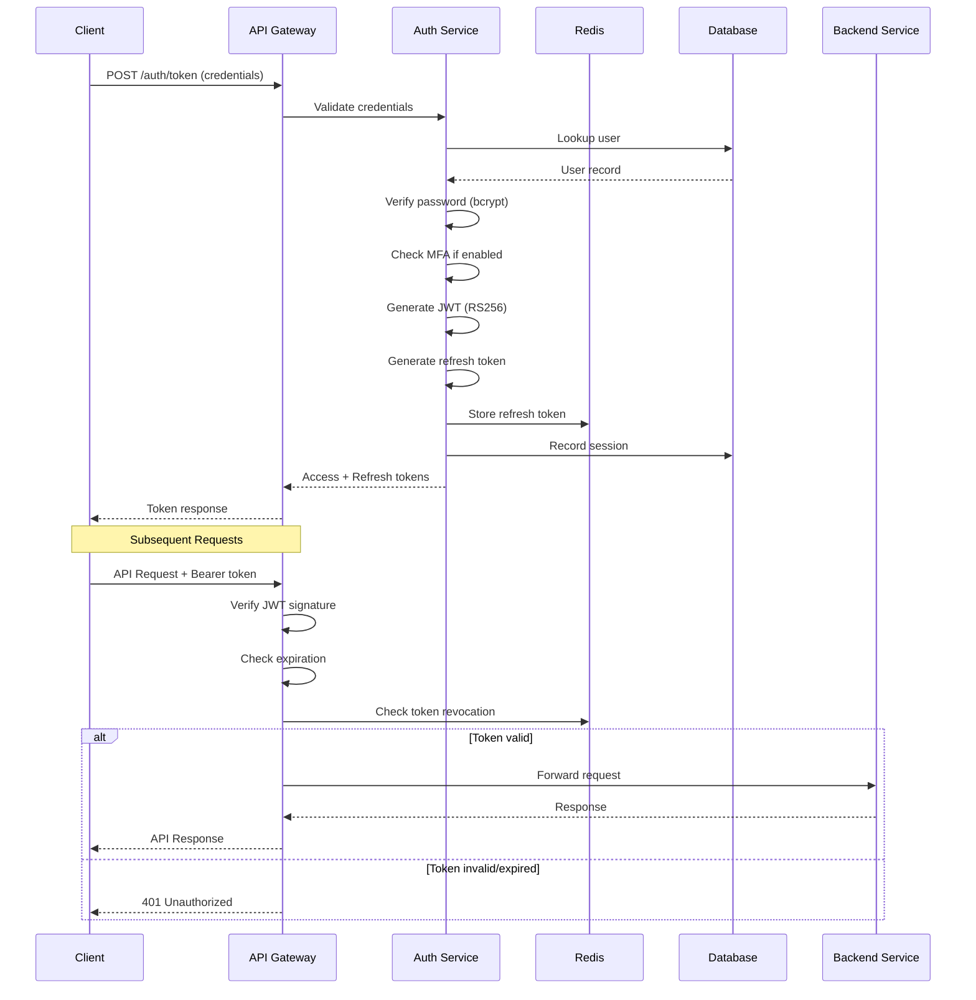
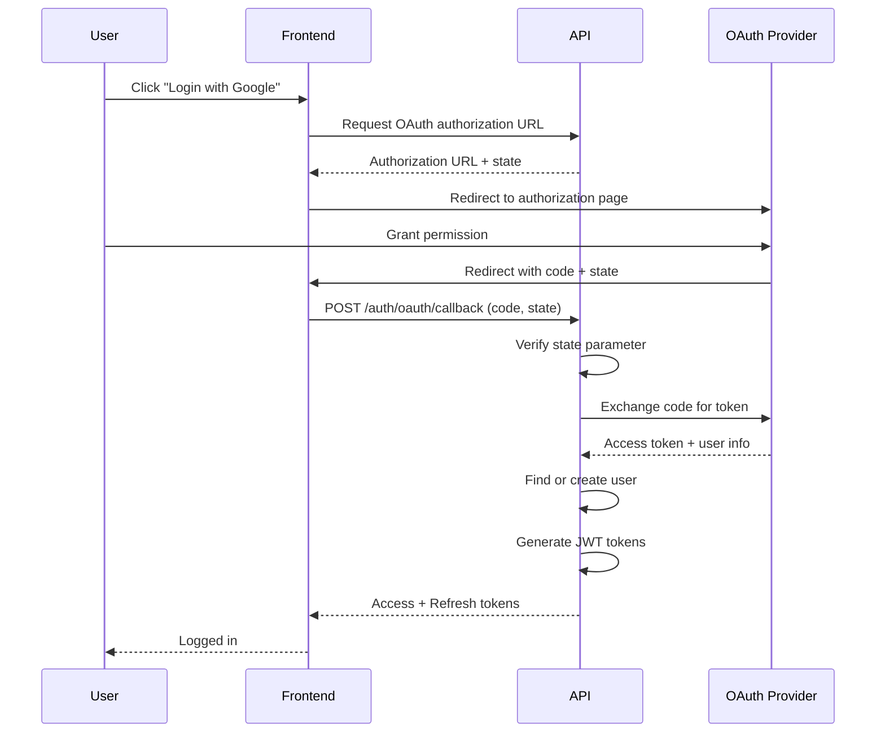
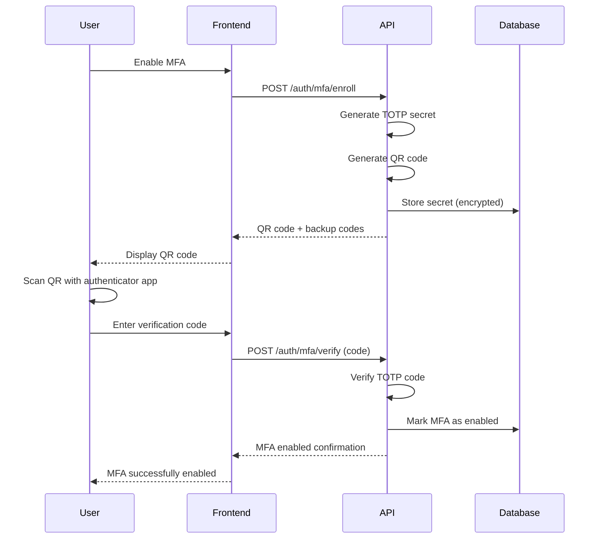
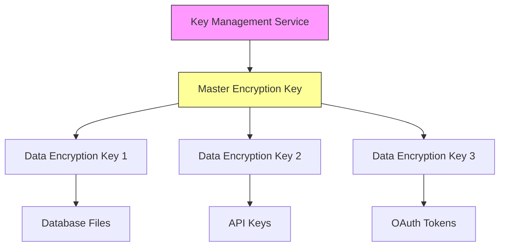

# 04. Security & Authentication

## Overview
Complete security and authentication specifications for the DAA autonomous learning system, including authentication mechanisms, authorization models, encryption standards, audit logging, and compliance requirements.

## Technical Requirements

### Authentication Mechanisms (REQ-T151 - REQ-T160)

**REQ-T151**: JWT Authentication
**Priority**: CRITICAL
**Algorithm**: RS256 with RSA key pairs
**Token Lifetime**: Access 15min, Refresh 7 days
**Acceptance**: Stateless token validation <10ms

**REQ-T152**: Password Requirements
**Priority**: CRITICAL
**Policy**: Min 12 chars, uppercase, lowercase, digit, special
**Hashing**: Bcrypt with cost factor 12
**Acceptance**: Password validation before hashing

**REQ-T153**: Multi-Factor Authentication (MFA)
**Priority**: HIGH
**Methods**: TOTP (primary), SMS (backup)
**Enforcement**: Required for admin roles, optional for users
**Acceptance**: MFA verification <50ms

**REQ-T154**: OAuth2 Integration
**Priority**: HIGH
**Providers**: Google, GitHub, Microsoft
**Flow**: Authorization Code with PKCE
**Acceptance**: Social login supported

**REQ-T155**: API Key Authentication
**Priority**: HIGH
**Format**: Prefix + random 32 bytes (hex encoded)
**Storage**: SHA-256 hashed in database
**Acceptance**: API key validation <10ms

**REQ-T156**: Session Management
**Priority**: HIGH
**Storage**: Redis (primary), PostgreSQL (backup)
**Lifetime**: 24 hours with sliding expiration
**Acceptance**: Concurrent session limit enforced

**REQ-T157**: Token Refresh
**Priority**: CRITICAL
**Mechanism**: Refresh token rotation
**Security**: One-time use refresh tokens
**Acceptance**: Refresh without re-authentication

**REQ-T158**: Token Revocation
**Priority**: HIGH
**Implementation**: Token blocklist in Redis
**Propagation**: <1 second across all instances
**Acceptance**: Revoked tokens immediately rejected

**REQ-T159**: Password Reset
**Priority**: HIGH
**Flow**: Email with time-limited token
**Token Lifetime**: 1 hour, single use
**Acceptance**: Secure reset without security questions

**REQ-T160**: Account Lockout
**Priority**: HIGH
**Policy**: 5 failed attempts, 15 minute lockout
**Notification**: Email on lockout event
**Acceptance**: Brute force attacks prevented

### Authorization & Access Control (REQ-T161 - REQ-T170)

**REQ-T161**: Role-Based Access Control (RBAC)
**Priority**: CRITICAL
**Model**: Users → Roles → Permissions
**Hierarchy**: Support role inheritance
**Acceptance**: Permission checks <5ms

**REQ-T162**: Resource-Level Permissions
**Priority**: HIGH
**Format**: resource:action (e.g., agents:write)
**Granularity**: Per-resource type
**Acceptance**: Fine-grained access control

**REQ-T163**: Owner-Based Access
**Priority**: HIGH
**Rule**: Users access own resources by default
**Override**: Admin roles bypass ownership
**Acceptance**: Ownership validated on every request

**REQ-T164**: Role Hierarchy
**Priority**: MEDIUM
**Structure**: Admin > Manager > User > Guest
**Inheritance**: Child roles inherit parent permissions
**Acceptance**: Hierarchical permission resolution

**REQ-T165**: Permission Scopes
**Priority**: HIGH
**Levels**: Global, Organization, Project, Resource
**Evaluation**: Most specific scope wins
**Acceptance**: Scoped permissions enforced

**REQ-T166**: API Key Scopes
**Priority**: HIGH
**Definition**: Limit API key permissions
**Format**: Array of permission strings
**Acceptance**: API keys restricted to defined scopes

**REQ-T167**: Time-Based Access
**Priority**: MEDIUM
**Support**: Temporary permission grants
**Expiration**: Automatic revocation after expiry
**Acceptance**: Time-limited access enforced

**REQ-T168**: IP Whitelisting
**Priority**: MEDIUM
**Configuration**: Per-user or per-API-key
**Validation**: CIDR block matching
**Acceptance**: Requests from non-whitelisted IPs rejected

**REQ-T169**: Rate Limiting
**Priority**: HIGH
**Tiers**: Free 60/min, Pro 600/min, Enterprise 6000/min
**Granularity**: Per-user and per-IP
**Acceptance**: Rate limits enforced with 429 responses

**REQ-T170**: Admin Override
**Priority**: MEDIUM
**Capability**: Admins can act as any user
**Audit**: All overrides logged
**Acceptance**: Admin actions clearly attributed

### Encryption & Data Protection (REQ-T171 - REQ-T180)

**REQ-T171**: TLS Encryption
**Priority**: CRITICAL
**Version**: TLS 1.3 minimum
**Cipher Suites**: ECDHE-RSA-AES256-GCM-SHA384
**Acceptance**: All external traffic encrypted

**REQ-T172**: Database Encryption at Rest
**Priority**: CRITICAL
**Method**: Transparent Data Encryption (TDE)
**Algorithm**: AES-256-GCM
**Acceptance**: All database files encrypted

**REQ-T173**: Password Storage
**Priority**: CRITICAL
**Algorithm**: Bcrypt with cost factor 12
**Salt**: Unique per-password (automatic)
**Acceptance**: Passwords never stored in plaintext

**REQ-T174**: Sensitive Field Encryption
**Priority**: HIGH
**Fields**: API keys, OAuth tokens, MFA secrets
**Algorithm**: AES-256-GCM with key rotation
**Acceptance**: Application-level encryption

**REQ-T175**: Key Management
**Priority**: CRITICAL
**System**: HashiCorp Vault or AWS KMS
**Rotation**: Quarterly key rotation
**Acceptance**: Encryption keys never in code

**REQ-T176**: Secrets Management
**Priority**: CRITICAL
**Storage**: Kubernetes secrets, Vault
**Access**: Role-based secret access
**Acceptance**: No secrets in environment variables

**REQ-T177**: Data Masking
**Priority**: MEDIUM
**Application**: Logs, error messages, API responses
**Fields**: Passwords, tokens, PII
**Acceptance**: Sensitive data never logged

**REQ-T178**: Secure Random Generation
**Priority**: HIGH
**Source**: Cryptographically secure PRNG
**Usage**: Tokens, IDs, salts
**Acceptance**: crypto.randomBytes() used

**REQ-T179**: Certificate Management
**Priority**: HIGH
**Issuance**: Let's Encrypt or internal CA
**Renewal**: Automated certificate renewal
**Acceptance**: Certificates renewed before expiry

**REQ-T180**: mTLS for Internal Services
**Priority**: MEDIUM
**Implementation**: Istio service mesh
**Validation**: Certificate-based authentication
**Acceptance**: All inter-service traffic mTLS

### Audit & Compliance (REQ-T181 - REQ-T190)

**REQ-T181**: Audit Logging
**Priority**: CRITICAL
**Events**: All state changes, auth events, admin actions
**Storage**: Immutable append-only table
**Acceptance**: Comprehensive audit trail

**REQ-T182**: Audit Log Retention
**Priority**: HIGH
**Duration**: 7 years for compliance
**Archive**: Cold storage after 1 year
**Acceptance**: Audit logs never deleted

**REQ-T183**: Tamper Detection
**Priority**: HIGH
**Method**: Cryptographic hash chain
**Validation**: Periodic integrity checks
**Acceptance**: Tampering detected

**REQ-T184**: GDPR Compliance
**Priority**: CRITICAL
**Features**: Right to access, rectification, erasure, portability
**Implementation**: Data export API, delete workflows
**Acceptance**: GDPR requirements met

**REQ-T185**: Data Retention Policies
**Priority**: HIGH
**Personal Data**: Deleted after 2 years inactive
**Audit Logs**: 7 years retention
**Acceptance**: Automated data lifecycle

**REQ-T186**: Privacy by Design
**Priority**: HIGH
**Principles**: Data minimization, purpose limitation
**Implementation**: Collect only necessary data
**Acceptance**: Privacy impact assessments done

**REQ-T187**: SOC2 Compliance
**Priority**: HIGH
**Controls**: Access control, encryption, monitoring
**Audit**: Annual SOC2 Type II audit
**Acceptance**: SOC2 certification obtained

**REQ-T188**: PCI DSS (if applicable)
**Priority**: MEDIUM
**Scope**: No card data storage
**Compliance**: Use certified payment processor
**Acceptance**: PCI DSS requirements met

**REQ-T189**: Data Classification
**Priority**: MEDIUM
**Levels**: Public, Internal, Confidential, Restricted
**Handling**: Different security controls per level
**Acceptance**: All data classified

**REQ-T190**: Incident Response Plan
**Priority**: HIGH
**Documentation**: Detailed incident procedures
**Testing**: Quarterly incident drills
**Acceptance**: Response plan documented

### Security Testing & Monitoring (REQ-T191 - REQ-T200)

**REQ-T191**: Vulnerability Scanning
**Priority**: HIGH
**Frequency**: Weekly automated scans
**Tools**: Trivy, Snyk, OWASP Dependency-Check
**Acceptance**: Critical vulnerabilities patched within 24h

**REQ-T192**: Penetration Testing
**Priority**: HIGH
**Frequency**: Quarterly external pentests
**Scope**: Full application and infrastructure
**Acceptance**: No critical findings unresolved

**REQ-T193**: Security Headers
**Priority**: HIGH
**Headers**: CSP, HSTS, X-Frame-Options, X-Content-Type-Options
**Implementation**: Helmet.js middleware
**Acceptance**: A+ rating on securityheaders.com

**REQ-T194**: Input Validation
**Priority**: CRITICAL
**Method**: Whitelist validation on all inputs
**Libraries**: Joi, class-validator
**Acceptance**: No injection vulnerabilities

**REQ-T195**: SQL Injection Prevention
**Priority**: CRITICAL
**Method**: Parameterized queries only
**ORM**: TypeORM with query builder
**Acceptance**: No raw SQL with user input

**REQ-T196**: XSS Prevention
**Priority**: CRITICAL
**Method**: Output encoding, CSP headers
**Sanitization**: DOMPurify for rich text
**Acceptance**: No XSS vulnerabilities

**REQ-T197**: CSRF Protection
**Priority**: HIGH
**Method**: CSRF tokens, SameSite cookies
**Validation**: Token validation on state-changing operations
**Acceptance**: CSRF attacks prevented

**REQ-T198**: Security Monitoring
**Priority**: HIGH
**Tools**: WAF, IDS/IPS, SIEM
**Alerts**: Real-time security alerts
**Acceptance**: Security incidents detected

**REQ-T199**: Dependency Management
**Priority**: HIGH
**Tools**: Dependabot, Renovate
**Policy**: Dependencies updated within 7 days
**Acceptance**: No known vulnerable dependencies

**REQ-T200**: Security Training
**Priority**: MEDIUM
**Frequency**: Annual security training
**Coverage**: All developers and admins
**Acceptance**: Security awareness program

## Authentication Flow Diagrams

### JWT Authentication Flow



### OAuth2 Flow



### MFA Enrollment Flow



## Authorization Models

### RBAC Model

```yaml
roles:
  admin:
    description: "Full system access"
    permissions:
      - "*"

  manager:
    description: "Manage team resources"
    inherits: [user]
    permissions:
      - "agents:*"
      - "workflows:*"
      - "knowledge:*"
      - "users:read"
      - "analytics:read"

  user:
    description: "Standard user access"
    inherits: [guest]
    permissions:
      - "agents:read:own"
      - "agents:write:own"
      - "knowledge:read:own"
      - "knowledge:write:own"
      - "patterns:read:own"
      - "workflows:read:own"
      - "workflows:write:own"

  guest:
    description: "Read-only public access"
    permissions:
      - "public:read"
      - "docs:read"

permission_format: "resource:action:scope"

examples:
  - "agents:write:own"      # Write own agents
  - "agents:write:*"        # Write any agent
  - "knowledge:read:team"   # Read team knowledge
  - "*"                     # All permissions
```

### Permission Evaluation

```typescript
interface Permission {
  resource: string;  // e.g., "agents"
  action: string;    // e.g., "write"
  scope: string;     // e.g., "own", "team", "*"
}

class PermissionEvaluator {
  async checkPermission(
    user: User,
    requiredPermission: Permission,
    resourceOwnerId?: string
  ): Promise<boolean> {
    // 1. Get user permissions (with role inheritance)
    const userPermissions = await this.getUserPermissions(user);

    // 2. Check for wildcard permission
    if (userPermissions.includes("*")) {
      return true;
    }

    // 3. Check for exact match
    const permString = `${requiredPermission.resource}:${requiredPermission.action}:${requiredPermission.scope}`;
    if (userPermissions.includes(permString)) {
      return true;
    }

    // 4. Check resource wildcard
    const resourceWildcard = `${requiredPermission.resource}:*`;
    if (userPermissions.includes(resourceWildcard)) {
      return true;
    }

    // 5. Check scope-based access
    if (requiredPermission.scope === "own") {
      const ownPerm = `${requiredPermission.resource}:${requiredPermission.action}:own`;
      if (userPermissions.includes(ownPerm) && resourceOwnerId === user.id) {
        return true;
      }
    }

    return false;
  }
}
```

## Encryption Specifications

### Data Encryption Standards

| Data Type | Algorithm | Key Size | Mode | Rotation |
|-----------|-----------|----------|------|----------|
| Database (TDE) | AES | 256-bit | GCM | Quarterly |
| API Keys | SHA-256 | 256-bit | Hash | N/A |
| Passwords | Bcrypt | - | Cost 12 | N/A |
| JWT Signing | RSA | 2048-bit | RS256 | Annually |
| Field Encryption | AES | 256-bit | GCM | Quarterly |
| TLS | ECDHE-RSA | 256-bit | GCM | Certificate renewal |

### Key Hierarchy



## Security Headers

```typescript
// Helmet.js Configuration
app.use(helmet({
  contentSecurityPolicy: {
    directives: {
      defaultSrc: ["'self'"],
      scriptSrc: ["'self'", "'unsafe-inline'"],
      styleSrc: ["'self'", "'unsafe-inline'"],
      imgSrc: ["'self'", "data:", "https:"],
      connectSrc: ["'self'", "https://api.daa.example.com"],
      fontSrc: ["'self'"],
      objectSrc: ["'none'"],
      mediaSrc: ["'self'"],
      frameSrc: ["'none'"],
    },
  },
  hsts: {
    maxAge: 31536000,
    includeSubDomains: true,
    preload: true,
  },
  frameguard: {
    action: 'deny',
  },
  xssFilter: true,
  noSniff: true,
  referrerPolicy: {
    policy: 'strict-origin-when-cross-origin',
  },
}));
```

## Audit Log Schema

```typescript
interface AuditLog {
  id: string;
  timestamp: Date;
  user_id?: string;
  agent_id?: string;
  action: string;           // e.g., "agent.created"
  resource_type: string;    // e.g., "agents"
  resource_id: string;
  changes?: {
    before: any;
    after: any;
  };
  ip_address: string;
  user_agent: string;
  request_id: string;
  status: "success" | "failure";
  error_message?: string;
}

// Audit Events
const AUDIT_EVENTS = [
  // Authentication
  "auth.login",
  "auth.logout",
  "auth.failed_login",
  "auth.mfa_enabled",
  "auth.mfa_disabled",
  "auth.password_changed",
  "auth.token_refreshed",

  // Agents
  "agent.created",
  "agent.updated",
  "agent.deleted",
  "agent.adapted",

  // Knowledge
  "knowledge.created",
  "knowledge.shared",
  "knowledge.deleted",

  // Admin
  "admin.user_created",
  "admin.user_deleted",
  "admin.role_assigned",
  "admin.permission_changed",
];
```

## Compliance Checklist

### GDPR Compliance

- [x] **Right to Access**: Users can export all their data
- [x] **Right to Rectification**: Users can update their information
- [x] **Right to Erasure**: Users can delete their accounts
- [x] **Right to Portability**: Data export in JSON format
- [x] **Consent Management**: Explicit consent for data processing
- [x] **Data Minimization**: Only collect necessary data
- [x] **Purpose Limitation**: Data used only for stated purposes
- [x] **Data Retention**: Automated deletion after 2 years inactive
- [x] **Privacy Policy**: Clear privacy policy displayed
- [x] **Data Breach Notification**: Process for breach notification

### SOC2 Trust Principles

- [x] **Security**: Access controls, encryption, monitoring
- [x] **Availability**: 99.9% uptime, redundancy, backups
- [x] **Processing Integrity**: Input validation, error handling
- [x] **Confidentiality**: Data classification, access restrictions
- [x] **Privacy**: Privacy controls, consent management

## Security Incident Response

```yaml
incident_response_plan:
  phases:
    1_preparation:
      - Security team identified
      - Incident response plan documented
      - Communication templates prepared
      - Monitoring tools configured

    2_detection:
      - Automated security monitoring
      - Alert triage process
      - Incident classification

    3_containment:
      - Isolate affected systems
      - Revoke compromised credentials
      - Block malicious IPs
      - Preserve evidence

    4_eradication:
      - Remove malware/backdoors
      - Patch vulnerabilities
      - Reset passwords
      - Update firewall rules

    5_recovery:
      - Restore from clean backups
      - Verify system integrity
      - Gradual service restoration
      - Enhanced monitoring

    6_lessons_learned:
      - Post-incident review
      - Document findings
      - Update security controls
      - Share learnings with team

  communication:
    internal:
      - Security team immediate notification
      - Executive team within 1 hour
      - All staff within 4 hours

    external:
      - Affected users within 72 hours
      - Regulators as required by law
      - Public disclosure if warranted
```

---

**Requirements**: REQ-T151 to REQ-T200 (50 requirements)
**Status**: ✅ Complete
**Version**: 1.0.0
**Last Updated**: 2025-11-27
