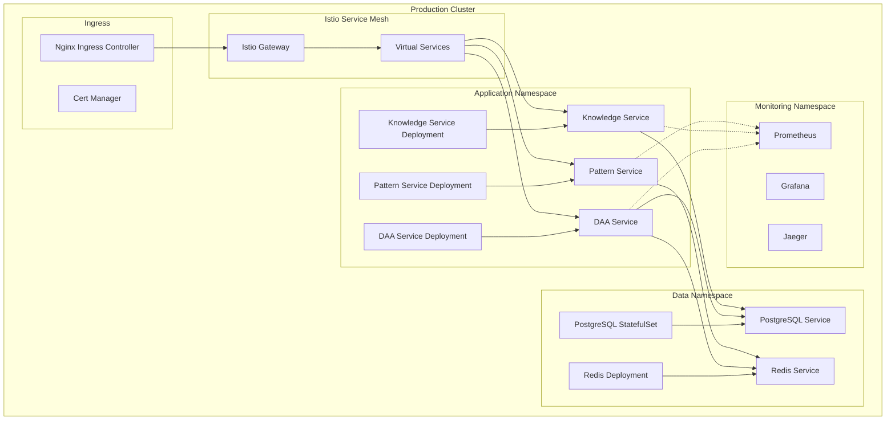

# 05. Deployment & Infrastructure

## Overview
Complete deployment and infrastructure specifications for the DAA autonomous learning system, including Kubernetes configuration, CI/CD pipelines, monitoring, disaster recovery, and environment management.

## Technical Requirements

### Container & Orchestration (REQ-T201 - REQ-T210)

**REQ-T201**: Docker Containerization
**Priority**: CRITICAL
**Base Images**: Node.js 18 Alpine, PostgreSQL 15 Alpine
**Size**: <500MB per service image
**Acceptance**: Multi-stage builds, optimized layers

**REQ-T202**: Kubernetes Deployment
**Priority**: CRITICAL
**Version**: Kubernetes 1.28+
**Distribution**: EKS, GKE, or AKS
**Acceptance**: Services deployed as Kubernetes resources

**REQ-T203**: Service Mesh
**Priority**: HIGH
**Implementation**: Istio 1.20+
**Features**: Traffic management, security, observability
**Acceptance**: All inter-service communication via mesh

**REQ-T204**: Namespace Isolation
**Priority**: HIGH
**Namespaces**: production, staging, development
**RBAC**: Namespace-level access control
**Acceptance**: Environment isolation enforced

**REQ-T205**: Resource Quotas
**Priority**: HIGH
**Limits**: CPU, memory, storage per namespace
**Enforcement**: Kubernetes ResourceQuota objects
**Acceptance**: Resource limits enforced

**REQ-T206**: Pod Security Policies
**Priority**: HIGH
**Policies**: Non-root containers, read-only root filesystem
**Enforcement**: Pod Security Standards
**Acceptance**: Security policies enforced

**REQ-T207**: Network Policies
**Priority**: HIGH
**Implementation**: Calico or Cilium
**Rules**: Default deny, explicit allow
**Acceptance**: Pod-to-pod traffic controlled

**REQ-T208**: Persistent Storage
**Priority**: CRITICAL
**Class**: SSD-backed storage class
**Provisioning**: Dynamic PersistentVolume provisioning
**Acceptance**: Stateful workloads supported

**REQ-T209**: ConfigMaps & Secrets
**Priority**: CRITICAL
**Usage**: Environment-specific configuration
**Encryption**: Secrets encrypted at rest
**Acceptance**: No hardcoded configuration

**REQ-T210**: Helm Charts
**Priority**: HIGH
**Structure**: Helm 3 charts for all services
**Versioning**: Semantic versioning for charts
**Acceptance**: Templated deployment manifests

### CI/CD Pipeline (REQ-T211 - REQ-T220)

**REQ-T211**: Source Control
**Priority**: CRITICAL
**Platform**: GitHub
**Branching**: Trunk-based development
**Acceptance**: All code in version control

**REQ-T212**: Continuous Integration
**Priority**: CRITICAL
**Platform**: GitHub Actions
**Triggers**: Push, pull request
**Acceptance**: Automated builds and tests

**REQ-T213**: Automated Testing
**Priority**: CRITICAL
**Levels**: Unit, integration, e2e
**Coverage**: Minimum 80% code coverage
**Acceptance**: Tests run on every commit

**REQ-T214**: Code Quality Checks
**Priority**: HIGH
**Tools**: ESLint, Prettier, SonarQube
**Gates**: Quality gates in CI pipeline
**Acceptance**: Code quality standards enforced

**REQ-T215**: Container Image Scanning
**Priority**: HIGH
**Tools**: Trivy, Snyk Container
**Frequency**: Every build
**Acceptance**: No critical vulnerabilities in images

**REQ-T216**: Artifact Registry
**Priority**: CRITICAL
**Platform**: Docker Hub, GitHub Container Registry, or ECR
**Retention**: 30 days for non-production
**Acceptance**: Immutable image tags

**REQ-T217**: Continuous Deployment
**Priority**: HIGH
**Platform**: ArgoCD or Flux
**Strategy**: GitOps-based deployment
**Acceptance**: Git as single source of truth

**REQ-T218**: Deployment Strategies
**Priority**: HIGH
**Strategies**: Rolling update, blue-green, canary
**Rollback**: Automatic rollback on failure
**Acceptance**: Zero-downtime deployments

**REQ-T219**: Environment Promotion
**Priority**: HIGH
**Flow**: dev → staging → production
**Gating**: Manual approval for production
**Acceptance**: Controlled production deployments

**REQ-T220**: Release Management
**Priority**: MEDIUM
**Versioning**: Semantic versioning (SemVer)
**Changelog**: Automated changelog generation
**Acceptance**: Tagged releases with notes

### Monitoring & Observability (REQ-T221 - REQ-T230)

**REQ-T221**: Metrics Collection
**Priority**: CRITICAL
**Stack**: Prometheus + Grafana
**Exporters**: Node exporter, Postgres exporter, custom app metrics
**Acceptance**: Real-time metrics dashboard

**REQ-T222**: Application Metrics
**Priority**: HIGH
**Framework**: Prometheus client libraries
**Metrics**: Request rate, latency, error rate (RED)
**Acceptance**: Service-level metrics exposed

**REQ-T223**: Infrastructure Metrics
**Priority**: HIGH
**Coverage**: CPU, memory, disk, network
**Granularity**: Per-pod and per-node
**Acceptance**: Infrastructure health visible

**REQ-T224**: Alerting
**Priority**: CRITICAL
**Platform**: Alertmanager + PagerDuty
**Routing**: Severity-based routing
**Acceptance**: Critical alerts within 1 minute

**REQ-T225**: Distributed Tracing
**Priority**: HIGH
**Stack**: Jaeger or Zipkin
**Integration**: OpenTelemetry
**Acceptance**: End-to-end request tracing

**REQ-T226**: Logging
**Priority**: CRITICAL
**Stack**: ELK (Elasticsearch, Logstash, Kibana) or Loki
**Format**: Structured JSON logging
**Acceptance**: Centralized log aggregation

**REQ-T227**: Log Retention
**Priority**: HIGH
**Duration**: 30 days hot, 90 days warm, 365 days cold
**Archival**: S3 or equivalent object storage
**Acceptance**: Log retention policy enforced

**REQ-T228**: Dashboards
**Priority**: HIGH
**Tools**: Grafana, Kibana
**Dashboards**: Service health, business metrics, SLI/SLO
**Acceptance**: Real-time operational visibility

**REQ-T229**: APM (Application Performance Monitoring)
**Priority**: MEDIUM
**Tools**: New Relic, Datadog, or open-source alternative
**Coverage**: Transaction tracing, database queries
**Acceptance**: Performance bottlenecks identifiable

**REQ-T230**: Uptime Monitoring
**Priority**: HIGH
**Tools**: Pingdom, UptimeRobot, or StatusCake
**Endpoints**: Health check endpoints
**Acceptance**: External uptime monitoring

### High Availability & Disaster Recovery (REQ-T231 - REQ-T240)

**REQ-T231**: Multi-AZ Deployment
**Priority**: CRITICAL
**Configuration**: Services across 3 availability zones
**Affinity**: Pod anti-affinity rules
**Acceptance**: Zone failure tolerance

**REQ-T232**: Load Balancing
**Priority**: CRITICAL
**Implementation**: Kubernetes Service (LoadBalancer)
**Algorithm**: Round-robin or least connections
**Acceptance**: Traffic distributed evenly

**REQ-T233**: Auto-Scaling
**Priority**: CRITICAL
**HPA**: Horizontal Pod Autoscaler
**VPA**: Vertical Pod Autoscaler (optional)
**Acceptance**: Automatic scaling based on metrics

**REQ-T234**: Database Replication
**Priority**: CRITICAL
**Configuration**: 1 primary + 3 read replicas
**Lag**: <5 seconds replication lag
**Acceptance**: Read scalability and redundancy

**REQ-T235**: Database Backups
**Priority**: CRITICAL
**Schedule**: Daily full, hourly incremental
**Retention**: 30 days
**Acceptance**: Automated backup and verification

**REQ-T236**: Point-in-Time Recovery
**Priority**: HIGH
**Implementation**: PostgreSQL WAL archiving
**Retention**: 7 days
**Acceptance**: Restore to any point in time

**REQ-T237**: Disaster Recovery Site
**Priority**: HIGH
**Configuration**: Secondary region for DR
**RTO**: <1 hour
**RPO**: <5 minutes
**Acceptance**: DR drills quarterly

**REQ-T238**: Failover Automation
**Priority**: HIGH
**Implementation**: Automated failover scripts
**Testing**: Quarterly failover tests
**Acceptance**: Minimal manual intervention

**REQ-T239**: Backup Verification
**Priority**: HIGH
**Frequency**: Weekly backup restore tests
**Validation**: Data integrity checks
**Acceptance**: Backups proven restorable

**REQ-T240**: Incident Response Plan
**Priority**: HIGH
**Documentation**: Runbooks for common incidents
**Training**: Quarterly incident drills
**Acceptance**: Documented response procedures

### Environment Management (REQ-T241 - REQ-T250)

**REQ-T241**: Development Environment
**Priority**: HIGH
**Configuration**: Local Kubernetes (minikube, kind)
**Data**: Synthetic test data
**Acceptance**: Developers can run locally

**REQ-T242**: Staging Environment
**Priority**: CRITICAL
**Configuration**: Production-like infrastructure
**Data**: Anonymized production data
**Acceptance**: Pre-production testing environment

**REQ-T243**: Production Environment
**Priority**: CRITICAL
**Configuration**: Multi-AZ, auto-scaling
**Access**: Restricted access, audit logging
**Acceptance**: Production-grade infrastructure

**REQ-T244**: Ephemeral Environments
**Priority**: MEDIUM
**Use Case**: Per-PR preview environments
**Lifetime**: Temporary, deleted after merge
**Acceptance**: On-demand environment creation

**REQ-T245**: Environment Parity
**Priority**: HIGH
**Goal**: Dev/staging/prod infrastructure consistency
**Differences**: Only scale and data
**Acceptance**: "Works on my machine" issues eliminated

**REQ-T246**: Configuration Management
**Priority**: CRITICAL
**Tool**: Helm values, Kustomize overlays
**Storage**: Git repository
**Acceptance**: Environment-specific configuration

**REQ-T247**: Secret Management
**Priority**: CRITICAL
**Tool**: HashiCorp Vault, Sealed Secrets
**Rotation**: Quarterly secret rotation
**Acceptance**: Secrets never in Git

**REQ-T248**: Infrastructure as Code
**Priority**: HIGH
**Tool**: Terraform, Pulumi
**Coverage**: All cloud resources
**Acceptance**: Reproducible infrastructure

**REQ-T249**: State Management
**Priority**: HIGH
**Backend**: Terraform remote state (S3 + DynamoDB)
**Locking**: State locking enabled
**Acceptance**: Concurrent apply prevented

**REQ-T250**: Drift Detection
**Priority**: MEDIUM
**Frequency**: Daily drift detection
**Remediation**: Automated or manual correction
**Acceptance**: Infrastructure drift visible

## Kubernetes Architecture



## Kubernetes Manifests

### Deployment Example

```yaml
apiVersion: apps/v1
kind: Deployment
metadata:
  name: daa-service
  namespace: production
  labels:
    app: daa-service
    version: v1.0.0
spec:
  replicas: 3
  strategy:
    type: RollingUpdate
    rollingUpdate:
      maxSurge: 1
      maxUnavailable: 0
  selector:
    matchLabels:
      app: daa-service
  template:
    metadata:
      labels:
        app: daa-service
        version: v1.0.0
      annotations:
        prometheus.io/scrape: "true"
        prometheus.io/port: "3000"
        prometheus.io/path: "/metrics"
    spec:
      serviceAccountName: daa-service
      securityContext:
        runAsNonRoot: true
        runAsUser: 1000
        fsGroup: 1000

      affinity:
        podAntiAffinity:
          requiredDuringSchedulingIgnoredDuringExecution:
          - labelSelector:
              matchExpressions:
              - key: app
                operator: In
                values:
                - daa-service
            topologyKey: kubernetes.io/hostname

      containers:
      - name: daa-service
        image: ghcr.io/example/daa-service:v1.0.0
        imagePullPolicy: IfNotPresent

        ports:
        - name: http
          containerPort: 3000
          protocol: TCP
        - name: metrics
          containerPort: 9090
          protocol: TCP

        env:
        - name: NODE_ENV
          value: "production"
        - name: PORT
          value: "3000"
        - name: DATABASE_URL
          valueFrom:
            secretKeyRef:
              name: database-credentials
              key: url
        - name: REDIS_URL
          valueFrom:
            configMapKeyRef:
              name: redis-config
              key: url

        resources:
          requests:
            cpu: 250m
            memory: 512Mi
          limits:
            cpu: 500m
            memory: 1Gi

        livenessProbe:
          httpGet:
            path: /health/live
            port: http
          initialDelaySeconds: 30
          periodSeconds: 10
          timeoutSeconds: 5
          failureThreshold: 3

        readinessProbe:
          httpGet:
            path: /health/ready
            port: http
          initialDelaySeconds: 10
          periodSeconds: 5
          timeoutSeconds: 3
          failureThreshold: 3

        securityContext:
          allowPrivilegeEscalation: false
          readOnlyRootFilesystem: true
          capabilities:
            drop:
            - ALL

        volumeMounts:
        - name: tmp
          mountPath: /tmp
        - name: cache
          mountPath: /app/.cache

      volumes:
      - name: tmp
        emptyDir: {}
      - name: cache
        emptyDir: {}

---
apiVersion: v1
kind: Service
metadata:
  name: daa-service
  namespace: production
  labels:
    app: daa-service
spec:
  type: ClusterIP
  selector:
    app: daa-service
  ports:
  - name: http
    port: 80
    targetPort: http
    protocol: TCP
  - name: metrics
    port: 9090
    targetPort: metrics
    protocol: TCP

---
apiVersion: autoscaling/v2
kind: HorizontalPodAutoscaler
metadata:
  name: daa-service
  namespace: production
spec:
  scaleTargetRef:
    apiVersion: apps/v1
    kind: Deployment
    name: daa-service
  minReplicas: 3
  maxReplicas: 10
  metrics:
  - type: Resource
    resource:
      name: cpu
      target:
        type: Utilization
        averageUtilization: 70
  - type: Resource
    resource:
      name: memory
      target:
        type: Utilization
        averageUtilization: 80
  behavior:
    scaleDown:
      stabilizationWindowSeconds: 300
      policies:
      - type: Percent
        value: 50
        periodSeconds: 60
    scaleUp:
      stabilizationWindowSeconds: 60
      policies:
      - type: Percent
        value: 100
        periodSeconds: 60
      - type: Pods
        value: 2
        periodSeconds: 60
      selectPolicy: Max
```

## CI/CD Pipeline

### GitHub Actions Workflow

```yaml
name: CI/CD Pipeline

on:
  push:
    branches: [main, develop]
  pull_request:
    branches: [main, develop]

env:
  REGISTRY: ghcr.io
  IMAGE_NAME: ${{ github.repository }}

jobs:
  test:
    runs-on: ubuntu-latest
    steps:
      - uses: actions/checkout@v4

      - name: Setup Node.js
        uses: actions/setup-node@v4
        with:
          node-version: '18'
          cache: 'npm'

      - name: Install dependencies
        run: npm ci

      - name: Lint
        run: npm run lint

      - name: Type check
        run: npm run typecheck

      - name: Unit tests
        run: npm run test:unit

      - name: Integration tests
        run: npm run test:integration

      - name: Code coverage
        run: npm run test:coverage

      - name: Upload coverage
        uses: codecov/codecov-action@v3

  security:
    runs-on: ubuntu-latest
    steps:
      - uses: actions/checkout@v4

      - name: Run Snyk security scan
        uses: snyk/actions/node@master
        env:
          SNYK_TOKEN: ${{ secrets.SNYK_TOKEN }}

      - name: Run Trivy vulnerability scanner
        uses: aquasecurity/trivy-action@master
        with:
          scan-type: 'fs'
          scan-ref: '.'
          format: 'sarif'
          output: 'trivy-results.sarif'

  build:
    needs: [test, security]
    runs-on: ubuntu-latest
    permissions:
      contents: read
      packages: write
    steps:
      - uses: actions/checkout@v4

      - name: Log in to Container Registry
        uses: docker/login-action@v3
        with:
          registry: ${{ env.REGISTRY }}
          username: ${{ github.actor }}
          password: ${{ secrets.GITHUB_TOKEN }}

      - name: Extract metadata
        id: meta
        uses: docker/metadata-action@v5
        with:
          images: ${{ env.REGISTRY }}/${{ env.IMAGE_NAME }}
          tags: |
            type=ref,event=branch
            type=ref,event=pr
            type=semver,pattern={{version}}
            type=semver,pattern={{major}}.{{minor}}
            type=sha

      - name: Build and push Docker image
        uses: docker/build-push-action@v5
        with:
          context: .
          push: true
          tags: ${{ steps.meta.outputs.tags }}
          labels: ${{ steps.meta.outputs.labels }}
          cache-from: type=gha
          cache-to: type=gha,mode=max

      - name: Scan Docker image
        uses: aquasecurity/trivy-action@master
        with:
          image-ref: ${{ env.REGISTRY }}/${{ env.IMAGE_NAME }}:${{ steps.meta.outputs.version }}
          format: 'sarif'
          output: 'trivy-image-results.sarif'

  deploy-staging:
    needs: build
    if: github.ref == 'refs/heads/develop'
    runs-on: ubuntu-latest
    environment: staging
    steps:
      - uses: actions/checkout@v4

      - name: Update Kubernetes manifests
        run: |
          cd k8s/overlays/staging
          kustomize edit set image daa-service=${{ env.REGISTRY }}/${{ env.IMAGE_NAME }}:${{ github.sha }}

      - name: Commit and push
        run: |
          git config user.name github-actions
          git config user.email github-actions@github.com
          git add k8s/overlays/staging
          git commit -m "Update staging image to ${{ github.sha }}"
          git push

  deploy-production:
    needs: build
    if: github.ref == 'refs/heads/main'
    runs-on: ubuntu-latest
    environment: production
    steps:
      - uses: actions/checkout@v4

      - name: Create release
        uses: actions/create-release@v1
        env:
          GITHUB_TOKEN: ${{ secrets.GITHUB_TOKEN }}
        with:
          tag_name: ${{ github.ref }}
          release_name: Release ${{ github.ref }}
          draft: false
          prerelease: false

      - name: Update Kubernetes manifests
        run: |
          cd k8s/overlays/production
          kustomize edit set image daa-service=${{ env.REGISTRY }}/${{ env.IMAGE_NAME }}:${{ github.sha }}

      - name: Commit and push
        run: |
          git config user.name github-actions
          git config user.email github-actions@github.com
          git add k8s/overlays/production
          git commit -m "Update production image to ${{ github.sha }}"
          git push
```

## Infrastructure as Code

### Terraform Example

```hcl
# main.tf
terraform {
  required_version = ">= 1.6.0"

  required_providers {
    kubernetes = {
      source  = "hashicorp/kubernetes"
      version = "~> 2.23"
    }
    helm = {
      source  = "hashicorp/helm"
      version = "~> 2.11"
    }
  }

  backend "s3" {
    bucket         = "terraform-state-daa"
    key            = "production/terraform.tfstate"
    region         = "us-east-1"
    encrypt        = true
    dynamodb_table = "terraform-locks"
  }
}

provider "kubernetes" {
  config_path = "~/.kube/config"
}

provider "helm" {
  kubernetes {
    config_path = "~/.kube/config"
  }
}

# Namespace
resource "kubernetes_namespace" "production" {
  metadata {
    name = "production"
    labels = {
      environment = "production"
      managed-by  = "terraform"
    }
  }
}

# Istio Service Mesh
resource "helm_release" "istio_base" {
  name       = "istio-base"
  repository = "https://istio-release.storage.googleapis.com/charts"
  chart      = "base"
  namespace  = "istio-system"
  create_namespace = true
  version    = "1.20.0"
}

resource "helm_release" "istiod" {
  name       = "istiod"
  repository = "https://istio-release.storage.googleapis.com/charts"
  chart      = "istiod"
  namespace  = "istio-system"
  version    = "1.20.0"

  depends_on = [helm_release.istio_base]
}

# Prometheus Monitoring
resource "helm_release" "prometheus" {
  name       = "prometheus"
  repository = "https://prometheus-community.github.io/helm-charts"
  chart      = "kube-prometheus-stack"
  namespace  = "monitoring"
  create_namespace = true
  version    = "54.0.0"

  values = [
    file("${path.module}/values/prometheus.yaml")
  ]
}
```

## Monitoring Dashboards

### Grafana Dashboard Configuration

```json
{
  "dashboard": {
    "title": "DAA Service Overview",
    "panels": [
      {
        "title": "Request Rate",
        "targets": [
          {
            "expr": "rate(http_requests_total{service='daa-service'}[5m])"
          }
        ]
      },
      {
        "title": "Error Rate",
        "targets": [
          {
            "expr": "rate(http_requests_total{service='daa-service',status=~'5..'}[5m])"
          }
        ]
      },
      {
        "title": "Response Time (p95)",
        "targets": [
          {
            "expr": "histogram_quantile(0.95, rate(http_request_duration_seconds_bucket{service='daa-service'}[5m]))"
          }
        ]
      },
      {
        "title": "Active Agents",
        "targets": [
          {
            "expr": "agent_count{status='active'}"
          }
        ]
      }
    ]
  }
}
```

---

**Requirements**: REQ-T201 to REQ-T250 (50 requirements)
**Status**: ✅ Complete
**Version**: 1.0.0
**Last Updated**: 2025-11-27
