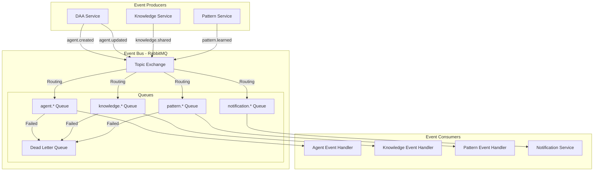
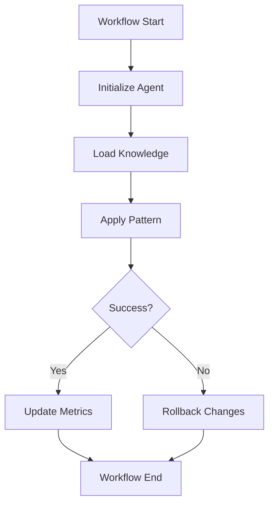

# 06. Integration Patterns

## Overview
Complete integration pattern specifications for the DAA autonomous learning system, including event-driven architecture, message queue integration, workflow orchestration, external API integration, and plugin systems.

## Technical Requirements

### Event-Driven Architecture (REQ-T251 - REQ-T260)

**REQ-T251**: Event Bus
**Priority**: CRITICAL
**Implementation**: RabbitMQ with topic exchanges
**Delivery**: At-least-once delivery guarantee
**Acceptance**: Events delivered reliably

**REQ-T252**: Event Schema
**Priority**: HIGH
**Format**: JSON with schema validation
**Versioning**: Schema version in event metadata
**Acceptance**: Backward-compatible event evolution

**REQ-T253**: Event Publishing
**Priority**: CRITICAL
**Pattern**: Publish-subscribe
**Routing**: Topic-based routing
**Acceptance**: Publishers decoupled from subscribers

**REQ-T254**: Event Subscription
**Priority**: CRITICAL
**Pattern**: Competing consumers
**Scaling**: Multiple consumer instances
**Acceptance**: Load balanced event processing

**REQ-T255**: Dead Letter Queue
**Priority**: HIGH
**Purpose**: Failed event processing
**Retention**: 7 days
**Acceptance**: Failed events queryable and replayable

**REQ-T256**: Event Replay
**Priority**: MEDIUM
**Capability**: Replay events from timestamp
**Use Case**: System recovery, reprocessing
**Acceptance**: Historical events replayable

**REQ-T257**: Event Ordering
**Priority**: MEDIUM
**Guarantee**: Per-partition ordering
**Implementation**: Message group ID
**Acceptance**: Related events processed in order

**REQ-T258**: Event Deduplication
**Priority**: HIGH
**Method**: Idempotency keys
**Window**: 24 hours
**Acceptance**: Duplicate events handled

**REQ-T259**: Event Monitoring
**Priority**: HIGH
**Metrics**: Publish rate, consume rate, lag
**Alerting**: High lag alerts
**Acceptance**: Event processing monitored

**REQ-T260**: Event Retention
**Priority**: MEDIUM
**Duration**: 30 days
**Archival**: S3 for long-term storage
**Acceptance**: Events archived for compliance

### Message Queue Integration (REQ-T261 - REQ-T270)

**REQ-T261**: RabbitMQ Cluster
**Priority**: CRITICAL
**Configuration**: 3-node cluster
**Mirroring**: Queue mirroring enabled
**Acceptance**: High availability messaging

**REQ-T262**: Exchange Types
**Priority**: HIGH
**Types**: Topic, direct, fanout
**Routing**: Pattern-based message routing
**Acceptance**: Flexible routing strategies

**REQ-T263**: Queue Durability
**Priority**: CRITICAL
**Configuration**: Durable queues and messages
**Persistence**: Messages persisted to disk
**Acceptance**: Messages survive broker restart

**REQ-T264**: Message Priority
**Priority**: MEDIUM
**Levels**: 0-9 (0=lowest, 9=highest)
**Processing**: Higher priority first
**Acceptance**: Critical events processed first

**REQ-T265**: Message TTL
**Priority**: HIGH
**Configuration**: Per-message or per-queue TTL
**Expiration**: Automatic message expiry
**Acceptance**: Stale messages removed

**REQ-T266**: Prefetch Limit
**Priority**: HIGH
**Configuration**: Consumer prefetch count
**Purpose**: Load balancing
**Acceptance**: Even message distribution

**REQ-T267**: Consumer Acknowledgment
**Priority**: CRITICAL
**Mode**: Manual acknowledgment
**Retry**: Automatic retry on failure
**Acceptance**: No message loss

**REQ-T268**: Connection Pooling
**Priority**: HIGH
**Implementation**: Shared connection per service
**Channels**: Multiple channels per connection
**Acceptance**: Efficient connection usage

**REQ-T269**: Queue Monitoring
**Priority**: HIGH
**Metrics**: Queue depth, consumer count, message rate
**Alerting**: Queue depth alerts
**Acceptance**: Queue health monitored

**REQ-T270**: Circuit Breaker
**Priority**: HIGH
**Pattern**: Circuit breaker for queue connections
**Recovery**: Automatic reconnection
**Acceptance**: Graceful degradation

### Workflow Orchestration (REQ-T271 - REQ-T280)

**REQ-T271**: Workflow Definition
**Priority**: CRITICAL
**Format**: JSON/YAML workflow definition
**Versioning**: Version control for workflows
**Acceptance**: Declarative workflow specification

**REQ-T272**: Workflow Engine
**Priority**: CRITICAL
**Implementation**: Custom or Temporal/Cadence
**Features**: State management, compensation
**Acceptance**: Reliable workflow execution

**REQ-T273**: Step Execution
**Priority**: HIGH
**Types**: Sequential, parallel, conditional
**Retry**: Automatic retry with backoff
**Acceptance**: Flexible step orchestration

**REQ-T274**: Workflow State
**Priority**: CRITICAL
**Storage**: PostgreSQL for state persistence
**Snapshots**: State snapshots at each step
**Acceptance**: Recoverable workflow state

**REQ-T275**: Compensation Logic
**Priority**: HIGH
**Pattern**: Saga pattern for distributed transactions
**Rollback**: Compensating transactions on failure
**Acceptance**: Eventual consistency

**REQ-T276**: Workflow Monitoring
**Priority**: HIGH
**Visibility**: Workflow execution status
**Metrics**: Success rate, duration, failure rate
**Acceptance**: Workflow health visible

**REQ-T277**: Human Tasks
**Priority**: MEDIUM
**Support**: Manual approval steps
**Timeout**: Configurable task timeout
**Acceptance**: Human-in-the-loop workflows

**REQ-T278**: Scheduled Workflows
**Priority**: MEDIUM
**Scheduling**: Cron-based scheduling
**Execution**: Distributed execution
**Acceptance**: Reliable scheduled jobs

**REQ-T279**: Workflow Versioning
**Priority**: HIGH
**Strategy**: Side-by-side version execution
**Migration**: Gradual workflow migration
**Acceptance**: Zero-downtime workflow updates

**REQ-T280**: Workflow Analytics
**Priority**: MEDIUM
**Metrics**: Execution time, bottlenecks, errors
**Reporting**: Workflow performance reports
**Acceptance**: Workflow optimization insights

### External API Integration (REQ-T281 - REQ-T290)

**REQ-T281**: REST Client
**Priority**: HIGH
**Library**: Axios with retry logic
**Timeout**: Configurable per-endpoint
**Acceptance**: Reliable external API calls

**REQ-T282**: GraphQL Client
**Priority**: MEDIUM
**Library**: Apollo Client
**Features**: Query batching, caching
**Acceptance**: Efficient GraphQL queries

**REQ-T283**: Webhook Handling
**Priority**: HIGH
**Validation**: Signature verification
**Retry**: Webhook retry logic
**Acceptance**: Secure webhook reception

**REQ-T284**: Webhook Delivery
**Priority**: HIGH
**Retry**: Exponential backoff (3 attempts)
**Logging**: Delivery status tracking
**Acceptance**: Reliable webhook delivery

**REQ-T285**: API Rate Limiting
**Priority**: HIGH
**Implementation**: Token bucket algorithm
**Backoff**: Respect rate limit headers
**Acceptance**: External rate limits honored

**REQ-T286**: API Caching
**Priority**: MEDIUM
**Strategy**: Cache-Control header compliance
**Storage**: Redis for API responses
**Acceptance**: Reduced external API calls

**REQ-T287**: API Versioning
**Priority**: HIGH
**Support**: Multiple external API versions
**Fallback**: Version fallback logic
**Acceptance**: API version changes handled

**REQ-T288**: OAuth Integration
**Priority**: HIGH
**Flow**: OAuth 2.0 client implementation
**Token Refresh**: Automatic token refresh
**Acceptance**: Secure third-party access

**REQ-T289**: API Documentation
**Priority**: MEDIUM
**Format**: OpenAPI 3.0 specification
**Generation**: Auto-generated from code
**Acceptance**: Up-to-date API docs

**REQ-T290**: API Mocking
**Priority**: MEDIUM
**Purpose**: Development and testing
**Tools**: Prism, WireMock
**Acceptance**: API mocks available

### Plugin System (REQ-T291 - REQ-T300)

**REQ-T291**: Plugin Architecture
**Priority**: MEDIUM
**Pattern**: Dynamic plugin loading
**Isolation**: Sandboxed plugin execution
**Acceptance**: Extensible system

**REQ-T292**: Plugin Discovery
**Priority**: MEDIUM
**Mechanism**: Plugin registry
**Installation**: npm-based plugins
**Acceptance**: Plugins discoverable

**REQ-T293**: Plugin API
**Priority**: MEDIUM
**Interface**: Standardized plugin interface
**Lifecycle**: init, execute, cleanup hooks
**Acceptance**: Consistent plugin interface

**REQ-T294**: Plugin Configuration
**Priority**: MEDIUM
**Format**: JSON/YAML configuration
**Validation**: Schema validation
**Acceptance**: Configurable plugins

**REQ-T295**: Plugin Versioning
**Priority**: MEDIUM
**Strategy**: Semantic versioning
**Compatibility**: Version compatibility checks
**Acceptance**: Plugin version management

**REQ-T296**: Plugin Security
**Priority**: HIGH
**Sandboxing**: VM2 or worker threads
**Permissions**: Capability-based security
**Acceptance**: Secure plugin execution

**REQ-T297**: Plugin Marketplace
**Priority**: LOW
**Platform**: Plugin registry and marketplace
**Publishing**: Plugin publishing workflow
**Acceptance**: Community plugin ecosystem

**REQ-T298**: Plugin Monitoring
**Priority**: MEDIUM
**Metrics**: Plugin execution time, errors
**Logging**: Plugin-specific logs
**Acceptance**: Plugin health monitored

**REQ-T299**: Plugin Testing
**Priority**: MEDIUM
**Framework**: Plugin test harness
**Coverage**: Unit and integration tests
**Acceptance**: Plugins testable

**REQ-T300**: Plugin Documentation
**Priority**: MEDIUM
**Format**: Markdown README
**Examples**: Usage examples
**Acceptance**: Plugin documentation available

## Event-Driven Architecture Diagram



## Workflow Orchestration Pattern



## Event Schema Examples

### Agent Created Event

```json
{
  "event_id": "550e8400-e29b-41d4-a716-446655440000",
  "event_type": "agent.created",
  "event_version": "1.0",
  "timestamp": "2024-01-15T10:30:00Z",
  "source": "daa-service",
  "data": {
    "agent_id": "a1b2c3d4-e5f6-7890-abcd-ef1234567890",
    "type": "researcher",
    "cognitive_pattern": "systems",
    "created_by": "user123"
  },
  "metadata": {
    "correlation_id": "req_abc123",
    "causation_id": "evt_xyz789"
  }
}
```

### Knowledge Shared Event

```json
{
  "event_id": "660e8400-e29b-41d4-a716-446655440000",
  "event_type": "knowledge.shared",
  "event_version": "1.0",
  "timestamp": "2024-01-15T10:35:00Z",
  "source": "knowledge-service",
  "data": {
    "knowledge_id": "k1b2c3d4-e5f6-7890-abcd-ef1234567890",
    "source_agent_id": "a1b2c3d4-e5f6-7890-abcd-ef1234567890",
    "target_agent_ids": [
      "a2b2c3d4-e5f6-7890-abcd-ef1234567890",
      "a3b2c3d4-e5f6-7890-abcd-ef1234567890"
    ],
    "domain": "machine_learning"
  },
  "metadata": {
    "correlation_id": "req_abc123"
  }
}
```

## Message Queue Configuration

### RabbitMQ Setup

```typescript
// RabbitMQ Connection
import { connect, Connection, Channel } from 'amqplib';

class MessageBroker {
  private connection: Connection;
  private channel: Channel;

  async initialize() {
    this.connection = await connect({
      protocol: 'amqp',
      hostname: process.env.RABBITMQ_HOST,
      port: 5672,
      username: process.env.RABBITMQ_USER,
      password: process.env.RABBITMQ_PASS,
      vhost: '/',
      heartbeat: 60,
    });

    this.channel = await this.connection.createChannel();

    // Enable prefetch for load balancing
    await this.channel.prefetch(10);

    // Declare exchange
    await this.channel.assertExchange('events', 'topic', {
      durable: true,
    });

    // Declare queues
    await this.declareQueue('agent.events', 'agent.*');
    await this.declareQueue('knowledge.events', 'knowledge.*');
    await this.declareQueue('pattern.events', 'pattern.*');
  }

  private async declareQueue(queueName: string, routingKey: string) {
    // Declare dead letter exchange
    await this.channel.assertExchange('dlx', 'topic', { durable: true });

    // Declare queue with DLX
    await this.channel.assertQueue(queueName, {
      durable: true,
      deadLetterExchange: 'dlx',
      deadLetterRoutingKey: `dlx.${routingKey}`,
      messageTtl: 86400000, // 24 hours
    });

    // Bind queue to exchange
    await this.channel.bindQueue(queueName, 'events', routingKey);
  }

  async publish(routingKey: string, event: any) {
    const message = JSON.stringify(event);

    return this.channel.publish('events', routingKey, Buffer.from(message), {
      persistent: true,
      contentType: 'application/json',
      timestamp: Date.now(),
      messageId: event.event_id,
    });
  }

  async consume(queueName: string, handler: (event: any) => Promise<void>) {
    await this.channel.consume(queueName, async (msg) => {
      if (!msg) return;

      try {
        const event = JSON.parse(msg.content.toString());
        await handler(event);

        // Acknowledge successful processing
        this.channel.ack(msg);
      } catch (error) {
        console.error('Event processing failed:', error);

        // Reject and requeue or send to DLX
        this.channel.nack(msg, false, false);
      }
    });
  }
}
```

## Workflow Definition Example

```typescript
interface WorkflowStep {
  id: string;
  type: 'action' | 'decision' | 'parallel';
  action?: string;
  condition?: string;
  next?: string | string[];
  onError?: string;
  retry?: {
    attempts: number;
    backoff: number;
  };
}

interface WorkflowDefinition {
  id: string;
  name: string;
  version: string;
  steps: WorkflowStep[];
  compensation?: {
    [stepId: string]: string;
  };
}

const agentCreationWorkflow: WorkflowDefinition = {
  id: 'agent-creation-v1',
  name: 'Agent Creation Workflow',
  version: '1.0.0',
  steps: [
    {
      id: 'validate-input',
      type: 'action',
      action: 'validateAgentInput',
      next: 'create-agent',
      retry: { attempts: 3, backoff: 1000 },
    },
    {
      id: 'create-agent',
      type: 'action',
      action: 'createAgentRecord',
      next: 'initialize-parallel',
      onError: 'cleanup',
    },
    {
      id: 'initialize-parallel',
      type: 'parallel',
      next: [
        'initialize-knowledge',
        'initialize-patterns',
        'send-notification',
      ],
    },
    {
      id: 'initialize-knowledge',
      type: 'action',
      action: 'initializeKnowledgeBase',
    },
    {
      id: 'initialize-patterns',
      type: 'action',
      action: 'initializePatternStore',
    },
    {
      id: 'send-notification',
      type: 'action',
      action: 'sendCreationNotification',
    },
    {
      id: 'cleanup',
      type: 'action',
      action: 'rollbackAgentCreation',
    },
  ],
  compensation: {
    'create-agent': 'cleanup',
  },
};
```

## External API Integration Example

```typescript
import axios, { AxiosInstance } from 'axios';
import axiosRetry from 'axios-retry';

class ExternalAPIClient {
  private client: AxiosInstance;

  constructor(baseURL: string, apiKey: string) {
    this.client = axios.create({
      baseURL,
      timeout: 30000,
      headers: {
        'Content-Type': 'application/json',
        'Authorization': `Bearer ${apiKey}`,
      },
    });

    // Configure retry logic
    axiosRetry(this.client, {
      retries: 3,
      retryDelay: axiosRetry.exponentialDelay,
      retryCondition: (error) => {
        return axiosRetry.isNetworkOrIdempotentRequestError(error) ||
               error.response?.status === 429;
      },
      onRetry: (retryCount, error) => {
        console.log(`Retry attempt ${retryCount}:`, error.message);
      },
    });

    // Add response interceptor
    this.client.interceptors.response.use(
      response => response,
      async error => {
        if (error.response?.status === 401) {
          // Refresh token logic
          await this.refreshToken();
          return this.client.request(error.config);
        }
        throw error;
      }
    );
  }

  async request<T>(method: string, endpoint: string, data?: any): Promise<T> {
    const response = await this.client.request({
      method,
      url: endpoint,
      data,
    });
    return response.data;
  }

  private async refreshToken() {
    // Token refresh logic
  }
}
```

## Plugin System Example

```typescript
interface Plugin {
  name: string;
  version: string;
  init: () => Promise<void>;
  execute: (context: PluginContext) => Promise<any>;
  cleanup: () => Promise<void>;
}

interface PluginContext {
  agent: Agent;
  config: any;
  logger: Logger;
}

class PluginManager {
  private plugins: Map<string, Plugin> = new Map();

  async loadPlugin(pluginPath: string) {
    const plugin = await import(pluginPath);

    // Validate plugin interface
    if (!this.isValidPlugin(plugin)) {
      throw new Error('Invalid plugin interface');
    }

    await plugin.init();
    this.plugins.set(plugin.name, plugin);
  }

  async executePlugin(name: string, context: PluginContext) {
    const plugin = this.plugins.get(name);
    if (!plugin) {
      throw new Error(`Plugin ${name} not found`);
    }

    return await plugin.execute(context);
  }

  private isValidPlugin(plugin: any): plugin is Plugin {
    return typeof plugin.name === 'string' &&
           typeof plugin.version === 'string' &&
           typeof plugin.init === 'function' &&
           typeof plugin.execute === 'function' &&
           typeof plugin.cleanup === 'function';
  }
}
```

## Webhook Security

```typescript
import crypto from 'crypto';

class WebhookHandler {
  verifySignature(payload: string, signature: string, secret: string): boolean {
    const hmac = crypto.createHmac('sha256', secret);
    const digest = 'sha256=' + hmac.update(payload).digest('hex');

    return crypto.timingSafeEqual(
      Buffer.from(signature),
      Buffer.from(digest)
    );
  }

  async handleWebhook(req: Request) {
    const signature = req.headers['x-webhook-signature'];
    const payload = JSON.stringify(req.body);

    if (!this.verifySignature(payload, signature, process.env.WEBHOOK_SECRET)) {
      throw new Error('Invalid webhook signature');
    }

    // Process webhook
    await this.processWebhook(req.body);
  }

  private async processWebhook(data: any) {
    // Webhook processing logic
  }
}
```

---

**Requirements**: REQ-T251 to REQ-T300 (50 requirements)
**Status**: ✅ Complete
**Version**: 1.0.0
**Last Updated**: 2025-11-27
