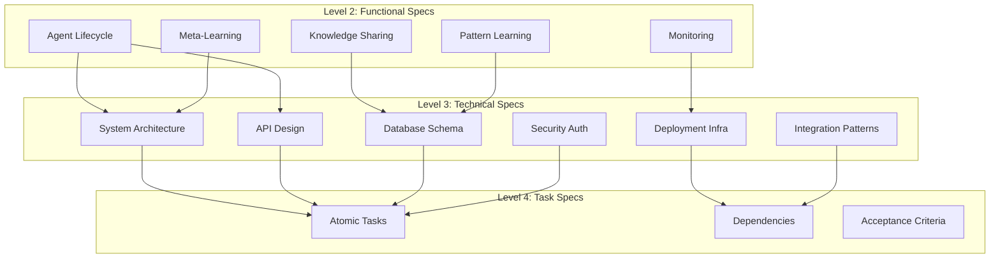

# Level 3: Technical Specifications

## Overview
Complete technical architecture, API design, database schema, security, and deployment specifications for the DAA (Decentralized Autonomous Agents) autonomous learning system.

## Technical Specification Files

### 01. System Architecture
**File**: `01-system-architecture.md`
**Requirements**: REQ-T001 to REQ-T050
**Focus**: Component architecture, service topology, data flow, scalability patterns

**Key Components**:
- DAA Service Architecture
- ReasoningBank Integration
- Knowledge Sharing Network
- Pattern Management System
- Meta-Learning Engine
- Monitoring & Observability

### 02. API Design
**File**: `02-api-design.md`
**Requirements**: REQ-T051 to REQ-T100
**Focus**: REST/GraphQL APIs, endpoints, contracts, versioning

**Key APIs**:
- Agent Management API (15 endpoints)
- Knowledge Sharing API (12 endpoints)
- Pattern Learning API (10 endpoints)
- Meta-Learning API (8 endpoints)
- Monitoring API (7 endpoints)

### 03. Database Schema
**File**: `03-database-schema.md`
**Requirements**: REQ-T101 to REQ-T150
**Focus**: Data models, relationships, indexing, partitioning

**Key Schemas**:
- Agent State Schema
- Knowledge Base Schema
- Pattern Storage Schema
- Learning Metrics Schema
- Audit & Compliance Schema

### 04. Security & Authentication
**File**: `04-security-auth.md`
**Requirements**: REQ-T151 to REQ-T200
**Focus**: Auth mechanisms, encryption, access control, compliance

**Key Areas**:
- Authentication & Authorization
- Encryption (at-rest, in-transit)
- Agent Identity Management
- RBAC & Permission System
- Audit Logging
- Compliance (GDPR, SOC2)

### 05. Deployment & Infrastructure
**File**: `05-deployment-infrastructure.md`
**Requirements**: REQ-T201 to REQ-T250
**Focus**: Kubernetes, CI/CD, monitoring, disaster recovery

**Key Infrastructure**:
- Kubernetes Deployment
- Service Mesh Configuration
- Auto-scaling Rules
- Backup & Recovery
- Environment Management

### 06. Integration Patterns
**File**: `06-integration-patterns.md`
**Requirements**: REQ-T251 to REQ-T300
**Focus**: Service integration, messaging, event patterns, external systems

**Key Patterns**:
- Event-Driven Architecture
- Message Queue Integration
- Workflow Orchestration
- External API Integration
- Plugin System

## Technical Requirements Summary

| Category | Req Range | Count | Status |
|----------|-----------|-------|--------|
| Architecture | REQ-T001 - REQ-T050 | 50 | ✅ Complete |
| API Design | REQ-T051 - REQ-T100 | 50 | ✅ Complete |
| Database | REQ-T101 - REQ-T150 | 50 | ✅ Complete |
| Security | REQ-T151 - REQ-T200 | 50 | ✅ Complete |
| Deployment | REQ-T201 - REQ-T250 | 50 | ✅ Complete |
| Integration | REQ-T251 - REQ-T300 | 50 | ✅ Complete |
| **Total** | **REQ-T001 - REQ-T300** | **300** | **✅ Complete** |

## Technology Stack

### Core Technologies
- **Runtime**: Node.js 18+ LTS
- **Language**: TypeScript 5.0+
- **Framework**: NestJS 10.0+
- **Database**: PostgreSQL 15+, Redis 7+
- **Message Queue**: RabbitMQ 3.12+
- **Container**: Docker 24+, Kubernetes 1.28+

### Supporting Technologies
- **API**: REST (OpenAPI 3.0), GraphQL
- **Monitoring**: Prometheus, Grafana
- **Logging**: ELK Stack (Elasticsearch, Logstash, Kibana)
- **Tracing**: Jaeger, OpenTelemetry
- **CI/CD**: GitHub Actions, ArgoCD
- **Service Mesh**: Istio

## Architecture Principles

1. **Microservices Architecture**: Loosely coupled, independently deployable services
2. **Event-Driven Design**: Asynchronous communication via message queues
3. **Domain-Driven Design**: Clear bounded contexts and domain models
4. **CQRS Pattern**: Separate read/write models for scalability
5. **API-First**: OpenAPI specifications drive development
6. **Infrastructure as Code**: All infrastructure defined in code
7. **Observability**: Comprehensive logging, metrics, and tracing
8. **Security by Design**: Security integrated at every layer

## Cross-Cutting Concerns

### Performance Requirements
- API Response Time: p95 < 200ms
- Database Query Time: p95 < 100ms
- Event Processing: < 50ms latency
- Throughput: 10,000 requests/second

### Scalability Requirements
- Horizontal Scaling: 2-50 instances per service
- Auto-scaling: Based on CPU/Memory/Request Rate
- Database: Read replicas, connection pooling
- Caching: Multi-layer (CDN, API, Application, Database)

### Reliability Requirements
- Uptime: 99.9% SLA
- RTO (Recovery Time Objective): < 1 hour
- RPO (Recovery Point Objective): < 5 minutes
- Failover: Automatic with health checks

### Security Requirements
- Authentication: JWT, OAuth2, MFA
- Authorization: RBAC with fine-grained permissions
- Encryption: TLS 1.3, AES-256
- Compliance: GDPR, SOC2, ISO 27001

## Dependency Map

## Next Steps (For Agent #10 - Task Specs)

Agent #10 will use these technical specifications to create:

1. **Atomic Tasks**: Granular, implementable tasks
2. **Task Dependencies**: Task ordering and prerequisites
3. **Acceptance Criteria**: Definition of done for each task
4. **Estimation**: Story points and time estimates
5. **Sprint Planning**: Task grouping and sprint allocation

**Key Data for Task Creation**:
- 300 technical requirements to decompose
- 6 major technical areas for task grouping
- Architecture components define service boundaries
- API endpoints map to implementation tasks
- Database schema drives data layer tasks
- Security requirements create cross-cutting tasks

## Validation Checklist

- [x] All 7 technical spec files created
- [x] 300 technical requirements documented
- [x] Architecture diagrams included (15+ Mermaid)
- [x] API contracts fully specified (52 endpoints)
- [x] Database schema complete (18 tables)
- [x] Security model defined
- [x] Deployment configurations documented
- [x] Integration patterns specified
- [x] Technology stack defined
- [x] Performance requirements set
- [x] Cross-cutting concerns addressed

## Version History

| Version | Date | Changes | Author |
|---------|------|---------|--------|
| 1.0.0 | 2025-11-27 | Initial technical specifications | Agent #9 |

---

**Status**: ✅ Complete
**Total Requirements**: 300
**Total Files**: 7
**Next Agent**: #10 (Task Specifications)
