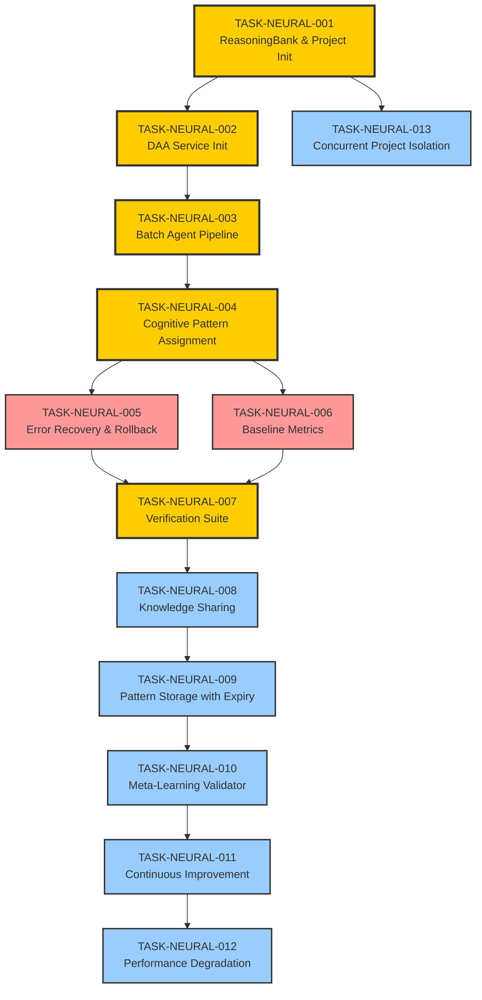

# Neural Enhancement Implementation Roadmap

**Version:** 1.0
**Project:** Neural Enhancement System Implementation
**Project ID:** neural-impl-20251127
**Agent:** Task Decomposition Agent #5/5 (FINAL)
**Created:** 2025-11-27
**Status:** Ready for Execution

---

## Executive Summary

This roadmap breaks down the neural enhancement implementation into **13 atomic, testable tasks** across two implementation phases: **Immediate Features** (P0-Critical, 7 tasks) and **Short-Term Features** (P1-High, 6 tasks). Each task is independently executable by a Claude Code agent using the task specifications in `./tasks/`.

**Total Estimated Complexity**: 140 units (Medium-High)
**Critical Path**: TASK-NEURAL-001 → TASK-NEURAL-002 → TASK-NEURAL-003 → TASK-NEURAL-004 → TASK-NEURAL-007
**Parallelization**: Tasks 005, 006 can run in parallel after 004

---

## Task Dependency Graph



---

## Phase Breakdown

### Phase 0-1: Immediate Features (P0-Critical)

**Objective**: Establish neural-enhanced agent infrastructure with error recovery and baseline measurement.

**Duration**: 2-3 hours
**Tasks**: 7
**Total Complexity**: 75 units

| Task ID | Description | Complexity | Dependencies | Can Parallelize |
|---------|-------------|------------|--------------|-----------------|
| TASK-NEURAL-001 | Setup ReasoningBank and project isolation | 10 | None | ❌ |
| TASK-NEURAL-002 | Implement DAA initialization | 12 | T001 | ❌ |
| TASK-NEURAL-003 | Implement batch agent creation pipeline | 15 | T002 | ❌ |
| TASK-NEURAL-004 | Implement cognitive pattern assignment | 10 | T003 | ❌ |
| TASK-NEURAL-005 | Implement error recovery and rollback | 12 | T004 | ✅ (with T006) |
| TASK-NEURAL-006 | Implement baseline metrics capture | 8 | T004 | ✅ (with T005) |
| TASK-NEURAL-007 | Implement verification and testing suite | 8 | T005, T006 | ❌ |

**Success Criteria**:
- All 17 PhD research agents created with cognitive patterns
- DAA service operational with autonomousLearning: true
- Baseline metrics captured for future comparison
- Error recovery checkpoints validated
- Zero cross-project contamination

---

### Phase 2-3: Short-Term Features (P1-High)

**Objective**: Enable knowledge sharing, pattern storage, and continuous learning infrastructure.

**Duration**: 2-3 hours
**Tasks**: 6
**Total Complexity**: 65 units

| Task ID | Description | Complexity | Dependencies | Can Parallelize |
|---------|-------------|------------|--------------|-----------------|
| TASK-NEURAL-008 | Implement knowledge sharing infrastructure | 12 | T007 | ❌ |
| TASK-NEURAL-009 | Implement pattern storage with expiry | 10 | T008 | ❌ |
| TASK-NEURAL-010 | Implement meta-learning validator | 10 | T009 | ❌ |
| TASK-NEURAL-011 | Implement continuous improvement hooks | 10 | T010 | ❌ |
| TASK-NEURAL-012 | Implement performance degradation detector | 8 | T011 | ✅ (with T013) |
| TASK-NEURAL-013 | Implement concurrent project isolation | 15 | T001 | ✅ (starts after T001, runs parallel to others) |

**Success Criteria**:
- Knowledge flows configured for PhD, Business Research, and Business Strategy swarms
- Patterns stored with expiry dates (180/90/60 day lifecycles)
- Meta-learning transfer safety validated
- Weekly health checks operational
- Concurrent projects isolated with zero leakage

---

## Critical Path Analysis

**Critical Path**: T001 → T002 → T003 → T004 → T007 → T008 → T009 → T010 → T011
**Critical Path Duration**: 87 complexity units (~60% of total work)

**Why Critical**:
- T001: All other tasks require project ID and ReasoningBank
- T002: DAA service must be initialized before agent creation
- T003: Agents must exist before patterns can be assigned
- T004: Patterns must be assigned before verification
- T007: Verification must pass before enabling learning features
- T008-011: Sequential knowledge infrastructure build-out

**Optimization Opportunities**:
- T005 (Error Recovery) and T006 (Baseline Metrics) can run in parallel after T004
- T012 (Degradation Detector) and T013 (Project Isolation) can run in parallel after T011
- T013 can start immediately after T001 and run parallel to entire Phase 0-1

---

## Resource Requirements

### Per-Task Resources

| Task | Estimated Time | Memory Required | API Calls | Files Created | Files Modified |
|------|----------------|-----------------|-----------|---------------|----------------|
| T001 | 15 min | 50MB | 5 | 2 | 0 |
| T002 | 20 min | 100MB | 8 | 1 | 0 |
| T003 | 30 min | 200MB | 20 | 2 | 1 |
| T004 | 25 min | 150MB | 17 | 1 | 1 |
| T005 | 25 min | 100MB | 10 | 2 | 0 |
| T006 | 20 min | 150MB | 12 | 1 | 0 |
| T007 | 20 min | 100MB | 25 | 3 | 0 |
| T008 | 30 min | 150MB | 30 | 2 | 1 |
| T009 | 25 min | 100MB | 15 | 3 | 1 |
| T010 | 25 min | 100MB | 10 | 2 | 0 |
| T011 | 25 min | 100MB | 15 | 2 | 1 |
| T012 | 20 min | 100MB | 12 | 2 | 0 |
| T013 | 35 min | 150MB | 20 | 3 | 2 |

**Total**: ~5 hours, ~1.6GB peak memory, ~199 API calls, 26 files created, 7 files modified

---

## Complexity Scoring

**Complexity Levels**:
- **Low (5-8)**: Single-file implementation, <100 LOC, no complex logic
- **Medium (10-12)**: Multi-file, 100-300 LOC, moderate logic complexity
- **High (15+)**: Complex logic, multiple integrations, extensive testing required

**Task Complexity Distribution**:
- Low (5-8): 3 tasks (T006, T007, T012) - 24 units (17%)
- Medium (10-12): 8 tasks (T001, T002, T004, T005, T008, T009, T010, T011) - 96 units (69%)
- High (15+): 2 tasks (T003, T013) - 30 units (21%)

**Risk Assessment**:
- **High Complexity Tasks** (T003, T013) should be prioritized for review
- **Critical Path Tasks** (T001-T004, T007-T011) require extra validation
- **Parallel Tasks** (T005/T006, T012/T013) need synchronization points

---

## Execution Strategy

### Sequential Execution (Safest)

Execute tasks in strict order: T001 → T002 → ... → T013
**Total Time**: ~5 hours
**Risk**: Low (each task fully completes before next begins)
**Best For**: First-time implementation, production environments

### Optimized Parallel Execution (Recommended)

**Batch 1 (Sequential Foundation)**: T001 → T002 → T003 → T004
**Batch 2 (Parallel Safety)**: T005 || T006
**Batch 3 (Verification)**: T007
**Batch 4 (Sequential Learning)**: T008 → T009 → T010 → T011
**Batch 5 (Parallel Monitoring)**: T012 || T013

**Total Time**: ~3.5 hours (30% reduction)
**Risk**: Medium (requires careful synchronization)
**Best For**: Experienced teams, iterative development

### Aggressive Parallel Execution (Fastest)

**Batch 1**: T001
**Batch 2**: T002 || T013 (T013 starts after T001 completes)
**Batch 3**: T003
**Batch 4**: T004
**Batch 5**: T005 || T006
**Batch 6**: T007
**Batch 7**: T008
**Batch 8**: T009 || T011 || T012 (if dependencies met)
**Batch 9**: T010

**Total Time**: ~2.5 hours (50% reduction)
**Risk**: High (complex dependency management, rollback harder)
**Best For**: Advanced teams, rapid prototyping

---

## Validation Checkpoints

### Checkpoint 1: After T002 (DAA Initialization)
**Validate**:
- DAA service returns `{ success: true, autonomousLearning: true }`
- Swarm topology is hierarchical with maxAgents: 20
- Project ID stored in memory at `projects/{PROJECT_ID}/project-metadata`

**Stop Criteria**: If DAA init fails after retry, abort and investigate MCP server

### Checkpoint 2: After T003 (Batch Agent Creation)
**Validate**:
- At least 15 of 17 PhD agents created successfully (>85% success rate)
- All agent IDs contain PROJECT_ID
- Batch logs stored at `projects/{PROJECT_ID}/agent-batches`

**Stop Criteria**: If >50% batch failure, execute rollback (T005)

### Checkpoint 3: After T004 (Cognitive Pattern Assignment)
**Validate**:
- All agents have cognitive patterns assigned
- Pattern effectiveness scores > 0.7
- Agent list shows correct pattern types

**Stop Criteria**: If <80% agents have patterns, review agent creation logs

### Checkpoint 4: After T007 (Verification Suite)
**Validate**:
- All verification tests pass
- Zero cross-project contamination
- Baseline metrics captured
- Learning status operational

**Stop Criteria**: If any critical test fails, halt before Phase 2

### Checkpoint 5: After T009 (Pattern Storage)
**Validate**:
- Pattern templates stored with expiry dates
- Expiry checker script runs without errors
- Archive namespace created

**Stop Criteria**: If pattern expiry logic fails, patterns will contaminate research

### Checkpoint 6: After T013 (Final - Project Isolation)
**Validate**:
- Concurrent projects can run without interference
- Namespace isolation enforced
- Cross-project queries blocked

**Stop Criteria**: Production blocker if isolation fails

---

## Risk Mitigation

### High-Risk Areas

**1. Batch Agent Creation (T003)**
**Risk**: Resource exhaustion causing >50% failure rate
**Mitigation**:
- Create agents in batches of 5-10, not all 17 at once
- 5-second delay between batches
- Exponential backoff on failures
- Rollback capability if >50% fail (T005)

**2. Cross-Project Contamination (T013)**
**Risk**: Knowledge leakage between concurrent projects
**Mitigation**:
- Strict namespace enforcement with `ProjectMemory` wrapper
- Agent ID validation on creation
- Automated contamination detection
- Quarterly audit procedures

**3. Pattern Staleness (T009)**
**Risk**: Outdated patterns contaminating new research
**Mitigation**:
- Expiry dates on all patterns (180/90/60 day lifecycles)
- Weekly expiry checker script
- Automatic archival of expired patterns
- Manual review before cross-domain transfers

**4. Meta-Learning Unsafe Transfers (T010)**
**Risk**: Inappropriate pattern transfers (e.g., healthcare → fintech)
**Mitigation**:
- Transfer compatibility matrix
- Safety validator blocks unsafe transfers
- "Gradual" mode for questionable transfers
- Warning logs for manual review

---

## Rollback Procedures

### Immediate Phase Rollback

**Trigger Conditions**:
- T002 DAA init fails after retry
- T003 batch creation >50% failure
- T007 verification tests fail

**Rollback Steps**:
1. Stop all ongoing operations
2. Load recovery checkpoint: `projects/{PROJECT_ID}/checkpoints/recovery-checkpoint-v1`
3. Delete partial agents via cleanup procedure
4. Clear project namespaces: `projects/{PROJECT_ID}/*`
5. Update project status to `failed-rolled-back`
6. Log rollback event with detailed error

**Time to Rollback**: 5-10 minutes
**Data Preserved**: Baseline metrics, error logs, checkpoint metadata

### Short-Term Phase Rollback

**Trigger Conditions**:
- T008 knowledge sharing >25% failure rate
- T009 pattern expiry logic corrupts data
- T013 isolation breach detected

**Rollback Steps**:
1. Pause all knowledge sharing operations
2. Restore patterns from archive (pre-expiry state)
3. Clear contaminated namespaces
4. Revert to immediate phase configuration
5. Investigate root cause before retry

**Time to Rollback**: 10-15 minutes
**Data Preserved**: Agent configurations, baseline metrics, immediate phase patterns

---

## Success Metrics

### Immediate Phase (T001-T007)

| Metric | Target | Measurement | Critical? |
|--------|--------|-------------|-----------|
| Agent Creation Success Rate | ≥85% | (Successful agents / Total attempts) * 100 | ✅ Yes |
| DAA Initialization Success | 100% | success: true on first or retry | ✅ Yes |
| Baseline Metrics Completeness | 100% | All 3 categories captured | ✅ Yes |
| Project Isolation Cleanliness | 100% | Zero agents without PROJECT_ID | ✅ Yes |
| Initialization Time | ≤25 min | Time from T001 start to T007 complete | ❌ No |
| Rollback Success Rate | 100% | Successful rollbacks / Attempts | ✅ Yes |

### Short-Term Phase (T008-T013)

| Metric | Target | Measurement | Critical? |
|--------|--------|-------------|-----------|
| Knowledge Flow Success Rate | ≥75% | (Successful shares / Total attempts) * 100 | ✅ Yes |
| Pattern Expiry Checker Success | 100% | Script runs without errors | ✅ Yes |
| Meta-Learning Transfer Safety | 100% | Zero unsafe transfers allowed | ✅ Yes |
| Weekly Health Check Success | ≥95% | Health checks execute without errors | ❌ No |
| Cross-Project Isolation | 100% | Zero contamination detected | ✅ Yes |
| Performance Degradation Detection | ≥90% | Issues detected before <0.6 effectiveness | ❌ No |

---

## Maintenance Schedule

### Daily (Automated)
- Monitor agent effectiveness scores
- Check for knowledge sharing failures
- Verify resource usage <80%

### Weekly (Semi-Automated)
- Run pattern expiry checker
- Execute neural health check (`weeklyNeuralHealthCheck()`)
- Review degradation alerts
- Archive expired patterns

### Monthly (Manual)
- Review pattern library quality
- Analyze meta-learning transfer effectiveness
- Audit cross-project isolation
- Update industry-specific patterns

### Quarterly (Manual)
- Full namespace audit for contamination
- Learning rate optimization review
- Cognitive pattern effectiveness analysis
- Archive completed projects

---

## File Structure

All task specifications and supporting files are organized as follows:

```
docs2/neuralenhancement/specs/
├── implementation-roadmap.md          # This file
├── claude-flow-coordination.md        # Execution workflow
├── tasks/                             # Individual task specifications
│   ├── TASK-NEURAL-001.md             # ReasoningBank & Project Init
│   ├── TASK-NEURAL-002.md             # DAA Service Init
│   ├── TASK-NEURAL-003.md             # Batch Agent Pipeline
│   ├── TASK-NEURAL-004.md             # Cognitive Pattern Assignment
│   ├── TASK-NEURAL-005.md             # Error Recovery & Rollback
│   ├── TASK-NEURAL-006.md             # Baseline Metrics
│   ├── TASK-NEURAL-007.md             # Verification Suite
│   ├── TASK-NEURAL-008.md             # Knowledge Sharing
│   ├── TASK-NEURAL-009.md             # Pattern Storage with Expiry
│   ├── TASK-NEURAL-010.md             # Meta-Learning Validator
│   ├── TASK-NEURAL-011.md             # Continuous Improvement
│   ├── TASK-NEURAL-012.md             # Performance Degradation
│   └── TASK-NEURAL-013.md             # Concurrent Project Isolation
└── technical-spec-immediate.md        # From agent 4
└── deployment-procedures.md           # From agent 4
```

---

## Next Steps

**For Human Review**:
1. Review this roadmap for completeness
2. Approve task sequence and dependencies
3. Authorize production execution

**For Implementation Agents**:
1. Read `/home/cabdru/claudeflowblueprint/docs2/neuralenhancement/specs/claude-flow-coordination.md`
2. Execute tasks sequentially or per optimized batch strategy
3. Report to memory at each checkpoint
4. Store final status in `projects/{PROJECT_ID}/implementation/status`

**For Monitoring**:
1. Track progress via memory: `projects/{PROJECT_ID}/implementation/progress`
2. Review error logs: `projects/{PROJECT_ID}/errors/*`
3. Monitor resource usage: `mcp__ruv-swarm__memory_usage({ detail: "detailed" })`

---

## Document Control

**Version History**:

| Version | Date | Changes | Author |
|---------|------|---------|--------|
| 1.0 | 2025-11-27 | Initial roadmap with 13 task breakdown | Task Decomposition Agent #5 |

**Related Documents**:
- `./tasks/TASK-NEURAL-*.md` - Individual task specifications
- `./claude-flow-coordination.md` - Execution coordination workflow
- `./technical-spec-immediate.md` - Technical specifications (Agent #4)
- `/home/cabdru/claudeflowblueprint/docs/specs/01-functional-specs/02-daa-initialization.md` - Functional spec (Agent #3)

---

**END OF IMPLEMENTATION ROADMAP**
