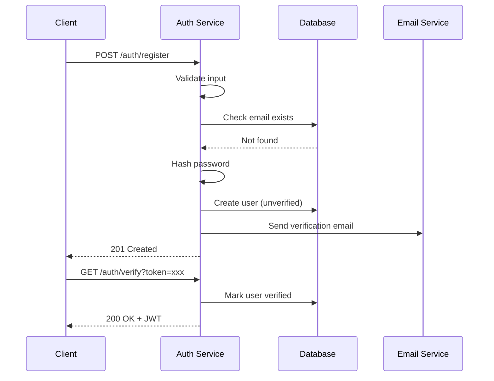
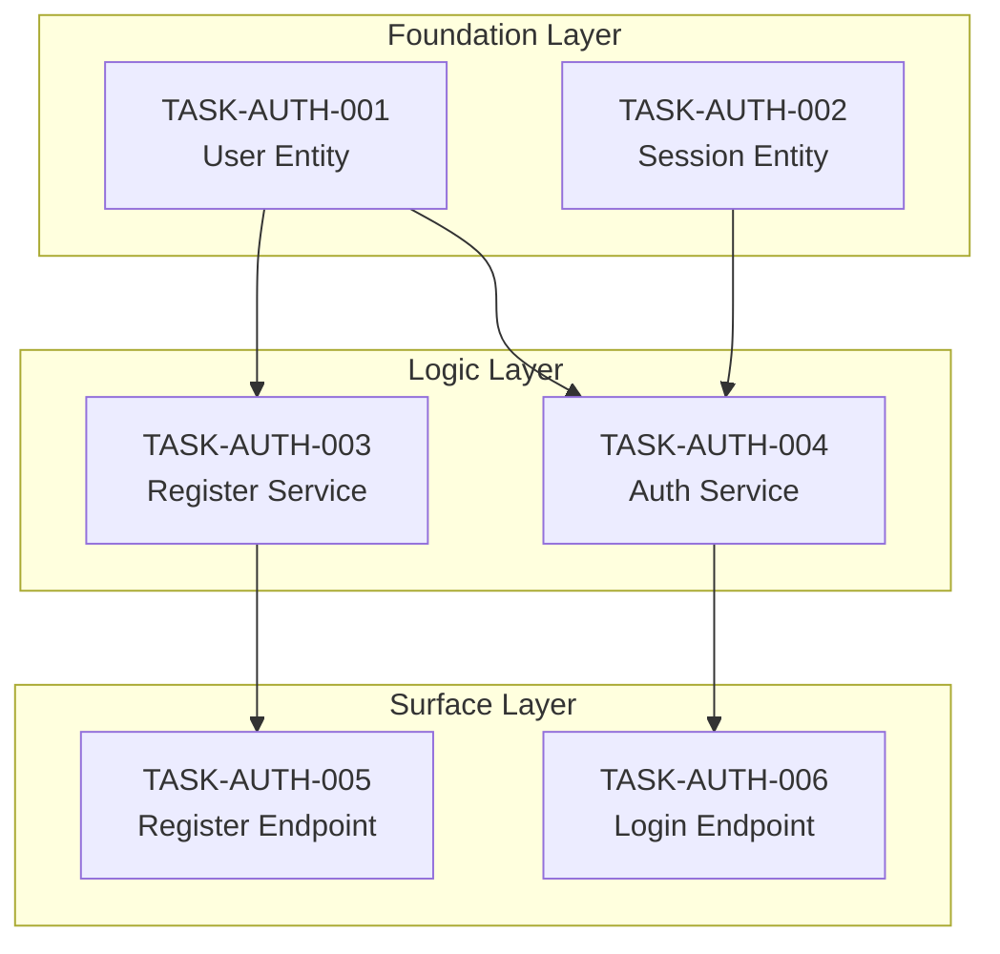

# AI-Agent Specification Development Guide

## A Complete Framework for Translating PRDs into Machine-Executable Specifications and Sequential Tasks

---

## Part 1: Foundation Principles

### 1.1 The Core Philosophy

Specifications for AI agents serve a fundamentally different purpose than traditional documentation. They function as **executable blueprints**—precise instruction sets that eliminate ambiguity and provide the AI with everything it needs to build autonomously.

Three principles govern this approach:

**Intent as source of truth.** The specification captures *what* the system should do and *why*, not how to implement it. Implementation details live in separate technical specifications. This separation allows the AI to make intelligent implementation choices while staying anchored to human intent.

**Machine-first, human-readable.** Every specification must be optimized for LLM parsing while remaining comprehensible to humans. This means explicit structure, unambiguous language, and predictable formatting patterns.

**Context persistence by design.** AI agents have no memory between sessions. Specifications must be self-contained enough that an agent can pick up work with zero prior context and continue correctly.

### 1.2 The Specification Hierarchy

Specifications exist in layers, each serving a distinct purpose:

```
Level 1: Project Constitution (immutable rules)
Level 2: Functional Specifications (what to build)
Level 3: Technical Specifications (how to build it)
Level 4: Task Specifications (atomic work units)
Level 5: Context Files (live project state)
```

A PRD feeds into Levels 2-4. The Constitution and Context Files wrap around them to provide guardrails and memory.

### 1.3 The Two-Phase Workflow

This framework operates in two distinct phases:

**Phase A: Specification Creation** — Transform PRDs into complete, detailed specifications (Functional → Technical). This phase is about understanding and documenting *what* to build.

**Phase B: Task Generation** — Once specifications are complete and approved, decompose them into atomic, sequentially-executable tasks. This phase transforms specifications into a *deterministic assembly line* where completing tasks in order guarantees full implementation.

Both phases are essential. Specifications without tasks leave implementation to chance. Tasks without specifications lack the context needed for correct implementation.

---

## Part 2: Breaking Down a PRD

### 2.1 The PRD Decomposition Process

Product Requirements Documents typically arrive as narrative descriptions of features, user needs, and business goals. Your job is to transform this narrative into structured, traceable requirements.

**Step 1: Extract User Journeys**

Identify every distinct user type and their primary interactions with the system. For each journey, capture:

- Who is the user (role, permissions, context)
- What triggers this journey
- What constitutes success
- What could go wrong

**Step 2: Identify Functional Domains**

Group related functionality into domains. Common domains include:

- Authentication and authorization
- Data management (CRUD operations)
- Business logic and workflows
- Integrations and external systems
- Reporting and analytics
- Administration and configuration

**Step 3: Extract Requirements with IDs**

Every requirement gets a unique identifier following the pattern `[REQ-DOMAIN-##]`. This enables:

- Traceability from code back to requirements
- Automated compliance checking
- Clear communication about specific items

**Step 4: Identify Non-Functional Requirements**

Extract implicit requirements around performance, security, reliability, accessibility, and compliance. These often hide in PRD language like "fast," "secure," or "enterprise-grade."

**Step 5: Surface Edge Cases and Error States**

For each requirement, ask: What happens when this fails? What are the boundary conditions? What invalid inputs might users provide?

### 2.2 PRD Decomposition Template

Use this template to systematically process any PRD:

```markdown
## PRD Analysis: [Feature Name]

### Extracted User Types
| User Type | Description | Permission Level |
|-----------|-------------|------------------|
| [type]    | [desc]      | [level]          |

### User Journeys Identified
1. [Journey name]: [One-sentence description]
2. ...

### Functional Domains
- [ ] Domain 1: [name]
- [ ] Domain 2: [name]

### Requirements Extraction
| ID | Domain | Requirement | Source (PRD section) |
|----|--------|-------------|---------------------|
| REQ-XXX-01 | | | |

### Non-Functional Requirements
| ID | Category | Requirement | Metric |
|----|----------|-------------|--------|
| NFR-XXX-01 | | | |

### Edge Cases Identified
| Related Req | Edge Case | Expected Behavior |
|-------------|-----------|-------------------|
| | | |

### Open Questions for Stakeholders
1. [Question requiring clarification]
```

---

## Part 3: The Specification Document Structure

### 3.1 File Organization

Organize specifications in a predictable directory structure that AI agents can navigate reliably:

```
project-root/
├── .ai/                          # AI context and memory
│   ├── activeContext.md          # Current session state
│   ├── decisionLog.md            # Architectural decisions
│   └── progress.md               # Roadmap completion status
├── specs/
│   ├── constitution.md           # Immutable project rules
│   ├── functional/
│   │   ├── _index.md             # Manifest of all functional specs
│   │   ├── auth.md
│   │   ├── users.md
│   │   └── [domain].md
│   ├── technical/
│   │   ├── _index.md
│   │   ├── architecture.md
│   │   ├── data-models.md
│   │   └── api-contracts.md
│   └── tasks/
│       ├── _index.md             # Task manifest with dependency graph
│       ├── _traceability.md      # Coverage matrix
│       └── TASK-[DOMAIN]-[###].md
└── docs/
    └── diagrams/
        └── architecture.mmd       # Mermaid source files
```

### 3.2 The Constitution File

The constitution defines immutable rules that apply to every change. AI agents must check this before any implementation.

```xml
<constitution version="1.0" last_updated="YYYY-MM-DD">

<metadata>
  <project_name>Project Name</project_name>
  <spec_version>1.0.0</spec_version>
  <authors>Team/Individual</authors>
</metadata>

<tech_stack>
  <language version="X.X">Language Name</language>
  <framework version="X.X">Framework Name</framework>
  <database>Database Name</database>
  <required_libraries>
    <library version="X.X">Library 1</library>
    <library version="X.X">Library 2</library>
  </required_libraries>
</tech_stack>

<directory_structure>
<!-- Output of: tree -L 2 -I 'node_modules|.git|__pycache__' -->
src/
├── components/
├── services/
├── utils/
├── types/
└── config/
</directory_structure>

<coding_standards>
  <naming_conventions>
    <files>kebab-case for files, PascalCase for components</files>
    <variables>camelCase for variables, SCREAMING_SNAKE for constants</variables>
    <functions>camelCase, verb-first (e.g., getUserById)</functions>
  </naming_conventions>
  
  <file_organization>
    <rule>One component per file</rule>
    <rule>Co-locate tests with source files as [name].test.ts</rule>
    <rule>Shared utilities go in src/utils/</rule>
  </file_organization>
  
  <error_handling>
    <rule>All async operations must have explicit error handling</rule>
    <rule>Errors must be logged with context before re-throwing</rule>
    <rule>User-facing errors must use the ErrorBoundary pattern</rule>
  </error_handling>
</coding_standards>

<anti_patterns>
  <forbidden>
    <item reason="Deprecated">Do NOT use var; use const or let</item>
    <item reason="Security">Do NOT store secrets in code; use environment variables</item>
    <item reason="Consistency">Do NOT create new utility files without checking existing utils/</item>
    <item reason="Maintainability">Do NOT use magic numbers; define constants</item>
    <item reason="Testing">Do NOT stub data inline; use factories in tests/fixtures/</item>
    <item reason="Architecture">Do NOT call APIs directly from components; use service layer</item>
  </forbidden>
</anti_patterns>

<security_requirements>
  <rule id="SEC-01">All user input must be validated and sanitized</rule>
  <rule id="SEC-02">Authentication tokens expire after 24 hours</rule>
  <rule id="SEC-03">Passwords require minimum 12 characters with complexity</rule>
  <rule id="SEC-04">All API endpoints require authentication except /health and /auth/*</rule>
</security_requirements>

<performance_budgets>
  <metric name="initial_load">Less than 3 seconds on 3G</metric>
  <metric name="api_response">Less than 200ms p95</metric>
  <metric name="database_query">Less than 100ms p95</metric>
</performance_budgets>

<testing_requirements>
  <coverage_minimum>80% line coverage</coverage_minimum>
  <required_tests>
    <test_type>Unit tests for all business logic</test_type>
    <test_type>Integration tests for API endpoints</test_type>
    <test_type>E2E tests for critical user journeys</test_type>
  </required_tests>
</testing_requirements>

</constitution>
```

### 3.3 Functional Specification Template

Each functional spec describes a domain or feature in terms of user outcomes, not implementation details.

```xml
<functional_spec id="SPEC-AUTH" version="1.0">

<metadata>
  <title>Authentication System</title>
  <status>approved</status>
  <owner>Team/Person</owner>
  <last_updated>YYYY-MM-DD</last_updated>
  <related_specs>
    <spec_ref>SPEC-USERS</spec_ref>
  </related_specs>
</metadata>

<overview>
A concise description of what this feature/domain accomplishes and why it exists.
This should answer: What problem does this solve? Who benefits?
</overview>

<user_stories>

<story id="US-AUTH-01" priority="must-have">
  <narrative>
    As a new visitor
    I want to create an account with my email
    So that I can access personalized features
  </narrative>
  
  <acceptance_criteria>
    <criterion id="AC-01">
      <given>I am on the registration page</given>
      <when>I submit valid email, password, and name</when>
      <then>My account is created and I receive a verification email</then>
    </criterion>
    <criterion id="AC-02">
      <given>I am on the registration page</given>
      <when>I submit an email that already exists</when>
      <then>I see an error message "An account with this email already exists"</then>
    </criterion>
    <criterion id="AC-03">
      <given>I am on the registration page</given>
      <when>I submit a password shorter than 12 characters</when>
      <then>I see validation error before form submission</then>
    </criterion>
  </acceptance_criteria>
</story>

<story id="US-AUTH-02" priority="must-have">
  <narrative>
    As a registered user
    I want to log in with my credentials
    So that I can access my account
  </narrative>
  
  <acceptance_criteria>
    <criterion id="AC-01">
      <given>I have a verified account</given>
      <when>I submit correct email and password</when>
      <then>I am redirected to the dashboard with an active session</then>
    </criterion>
    <criterion id="AC-02">
      <given>I submit incorrect credentials</given>
      <when>I have failed 5 times in 15 minutes</when>
      <then>My account is temporarily locked for 30 minutes</then>
    </criterion>
  </acceptance_criteria>
</story>

</user_stories>

<requirements>

<requirement id="REQ-AUTH-01" story_ref="US-AUTH-01" priority="must">
  <description>Email validation must verify format and domain deliverability</description>
  <rationale>Prevents fake accounts and ensures communication channel works</rationale>
</requirement>

<requirement id="REQ-AUTH-02" story_ref="US-AUTH-01" priority="must">
  <description>Passwords must be hashed using bcrypt with cost factor 12</description>
  <rationale>Industry standard for password storage security</rationale>
</requirement>

<requirement id="REQ-AUTH-03" story_ref="US-AUTH-02" priority="must">
  <description>Session tokens must be JWT with 24-hour expiration</description>
  <rationale>Balances security with user convenience</rationale>
</requirement>

<requirement id="REQ-AUTH-04" story_ref="US-AUTH-02" priority="should">
  <description>Support "remember me" option extending session to 30 days</description>
  <rationale>Improves UX for trusted devices</rationale>
</requirement>

</requirements>

<edge_cases>

<edge_case id="EC-AUTH-01" req_ref="REQ-AUTH-01">
  <scenario>User registers with email containing plus addressing (user+tag@domain.com)</scenario>
  <expected_behavior>Accept as valid; treat as unique email address</expected_behavior>
</edge_case>

<edge_case id="EC-AUTH-02" req_ref="REQ-AUTH-02">
  <scenario>User attempts to set password that matches a known breached password</scenario>
  <expected_behavior>Reject with message "This password has been found in data breaches"</expected_behavior>
</edge_case>

<edge_case id="EC-AUTH-03" req_ref="REQ-AUTH-03">
  <scenario>User's session expires while filling out a long form</scenario>
  <expected_behavior>Preserve form data, redirect to login, restore after auth</expected_behavior>
</edge_case>

</edge_cases>

<error_states>

<error id="ERR-AUTH-01" http_code="400">
  <condition>Email format invalid</condition>
  <message>Please enter a valid email address</message>
  <recovery>Highlight email field, show format example</recovery>
</error>

<error id="ERR-AUTH-02" http_code="401">
  <condition>Invalid credentials</condition>
  <message>Email or password is incorrect</message>
  <recovery>Clear password field, maintain email, show "Forgot password?" link</recovery>
</error>

<error id="ERR-AUTH-03" http_code="429">
  <condition>Too many failed attempts</condition>
  <message>Account temporarily locked. Try again in {minutes} minutes.</message>
  <recovery>Show countdown timer, offer password reset option</recovery>
</error>

</error_states>

<test_plan>

<test_case id="TC-AUTH-01" type="unit" req_ref="REQ-AUTH-01">
  <description>Email validation accepts valid formats</description>
  <inputs>["user@domain.com", "user+tag@domain.co.uk", "user.name@sub.domain.com"]</inputs>
  <expected>All return true</expected>
</test_case>

<test_case id="TC-AUTH-02" type="unit" req_ref="REQ-AUTH-01">
  <description>Email validation rejects invalid formats</description>
  <inputs>["notanemail", "@domain.com", "user@", "user@domain"]</inputs>
  <expected>All return false</expected>
</test_case>

<test_case id="TC-AUTH-03" type="integration" req_ref="REQ-AUTH-02">
  <description>Password hashing produces verifiable hash</description>
  <steps>
    1. Hash password "TestPassword123!"
    2. Verify hash against same password
    3. Verify hash fails against different password
  </steps>
  <expected>Step 2 returns true, Step 3 returns false</expected>
</test_case>

<test_case id="TC-AUTH-04" type="e2e" story_ref="US-AUTH-01">
  <description>Complete registration flow</description>
  <steps>
    1. Navigate to /register
    2. Fill form with valid data
    3. Submit form
    4. Check for success message
    5. Verify email received (mock)
    6. Click verification link
    7. Verify account active
  </steps>
</test_case>

</test_plan>

</functional_spec>
```

### 3.4 Technical Specification Template

Technical specs define *how* to implement functional requirements. They're language-specific and architecture-aware.

```xml
<technical_spec id="TECH-AUTH" version="1.0" implements="SPEC-AUTH">

<metadata>
  <title>Authentication Implementation</title>
  <status>approved</status>
  <last_updated>YYYY-MM-DD</last_updated>
</metadata>

<architecture_diagram>

</architecture_diagram>

<data_models>

<model name="User">
  <field name="id" type="UUID" constraints="primary_key, auto_generated"/>
  <field name="email" type="string(255)" constraints="unique, not_null, indexed"/>
  <field name="password_hash" type="string(60)" constraints="not_null"/>
  <field name="name" type="string(100)" constraints="not_null"/>
  <field name="email_verified" type="boolean" constraints="default: false"/>
  <field name="created_at" type="timestamp" constraints="not_null, auto_generated"/>
  <field name="updated_at" type="timestamp" constraints="not_null, auto_updated"/>
  <field name="locked_until" type="timestamp" constraints="nullable"/>
  <field name="failed_login_attempts" type="integer" constraints="default: 0"/>
</model>

<model name="Session">
  <field name="id" type="UUID" constraints="primary_key"/>
  <field name="user_id" type="UUID" constraints="foreign_key(User.id), indexed"/>
  <field name="token_hash" type="string(64)" constraints="unique, indexed"/>
  <field name="expires_at" type="timestamp" constraints="not_null"/>
  <field name="created_at" type="timestamp" constraints="not_null"/>
  <field name="remember_me" type="boolean" constraints="default: false"/>
</model>

</data_models>

<api_contracts>

<endpoint path="/auth/register" method="POST">
  <description>Create new user account</description>
  <implements>REQ-AUTH-01, REQ-AUTH-02</implements>
  
  <request_body content_type="application/json">
    <field name="email" type="string" required="true" validation="email format"/>
    <field name="password" type="string" required="true" validation="min 12 chars"/>
    <field name="name" type="string" required="true" validation="min 1, max 100 chars"/>
  </request_body>
  
  <responses>
    <response status="201">
      <description>Account created successfully</description>
      <body>
        {
          "id": "uuid",
          "email": "string",
          "name": "string",
          "message": "Verification email sent"
        }
      </body>
    </response>
    <response status="400">
      <description>Validation error</description>
      <body>
        {
          "error": "validation_error",
          "details": [{"field": "string", "message": "string"}]
        }
      </body>
    </response>
    <response status="409">
      <description>Email already exists</description>
      <body>
        {
          "error": "email_exists",
          "message": "An account with this email already exists"
        }
      </body>
    </response>
  </responses>
</endpoint>

<endpoint path="/auth/login" method="POST">
  <description>Authenticate user and create session</description>
  <implements>REQ-AUTH-03</implements>
  
  <request_body content_type="application/json">
    <field name="email" type="string" required="true"/>
    <field name="password" type="string" required="true"/>
    <field name="remember_me" type="boolean" required="false" default="false"/>
  </request_body>
  
  <responses>
    <response status="200">
      <description>Login successful</description>
      <body>
        {
          "token": "jwt_string",
          "expires_at": "iso_timestamp",
          "user": {
            "id": "uuid",
            "email": "string",
            "name": "string"
          }
        }
      </body>
    </response>
    <response status="401">
      <description>Invalid credentials</description>
    </response>
    <response status="429">
      <description>Account locked</description>
      <body>
        {
          "error": "account_locked",
          "locked_until": "iso_timestamp"
        }
      </body>
    </response>
  </responses>
</endpoint>

</api_contracts>

<component_contracts>

<component name="AuthService" path="src/services/auth.service.ts">
  <description>Core authentication business logic</description>
  
  <method name="registerUser">
    <signature>async registerUser(dto: RegisterDto): Promise&lt;User&gt;</signature>
    <implements>REQ-AUTH-01, REQ-AUTH-02</implements>
    <behavior>
      1. Validate email format
      2. Check email uniqueness
      3. Validate password strength
      4. Check password against breach database
      5. Hash password with bcrypt
      6. Create user record
      7. Generate verification token
      8. Queue verification email
      9. Return created user (without password_hash)
    </behavior>
    <throws>
      - ValidationError: Invalid input
      - ConflictError: Email exists
      - WeakPasswordError: Password in breach database
    </throws>
  </method>
  
  <method name="authenticateUser">
    <signature>async authenticateUser(email: string, password: string, rememberMe: boolean): Promise&lt;AuthResult&gt;</signature>
    <implements>REQ-AUTH-03, REQ-AUTH-04</implements>
    <behavior>
      1. Find user by email
      2. Check if account is locked
      3. Verify password against hash
      4. If failed: increment attempts, check for lockout threshold
      5. If success: reset failed attempts, generate JWT
      6. Set expiration based on rememberMe flag
      7. Create session record
      8. Return token and user data
    </behavior>
  </method>
  
</component>

</component_contracts>

<implementation_notes>

<note category="security">
JWT secret must be loaded from environment variable JWT_SECRET.
Minimum 256-bit key required.
</note>

<note category="performance">
Email uniqueness check should use database unique constraint, not SELECT.
Add index on (email, email_verified) for login queries.
</note>

<note category="integration">
Email service is async. Use message queue (defined in TECH-MESSAGING spec).
Do not await email delivery in registration flow.
</note>

</implementation_notes>

</technical_spec>
```

---

## Part 4: Task Generation — The Deterministic Assembly Line

> **CRITICAL:** This section applies AFTER all Functional and Technical Specifications are complete and approved. Do not generate tasks until specs are finalized. Tasks are the *output* of specifications, not a replacement for them.

### 4.1 The Core Principle: Inside-Out, Bottom-Up

**Do not slice by "Feature."** Slice by **Architectural Layer.**

If you give an agent a task to "Build Login," it will try to write the Database Model, Service, and Controller all at once. This leads to:

- Context overflow and hallucinated imports
- References to files that don't exist yet
- Tangled dependencies that break subsequent tasks

Instead, enforce this **strict generation order** for every feature:

```
┌─────────────────────────────────────────────────────────────────────┐
│  LAYER 1: DATA & TYPES (The Foundation)                            │
│  Source: <data_models> and DTOs from <api_contracts>               │
│  Output: Database migrations, ORM entities, TypeScript interfaces  │
│  Why: Zero dependencies. Must exist before anything can import.    │
└─────────────────────────────────────────────────────────────────────┘
                                 │
                                 ▼
┌─────────────────────────────────────────────────────────────────────┐
│  LAYER 2: PURE BUSINESS LOGIC (The Core)                           │
│  Source: <component_contracts> (Service Layer)                     │
│  Output: Service classes, business logic, Unit Tests               │
│  Why: Depends on Layer 1, but not on HTTP/Controllers.             │
│       Easy to unit test in isolation.                              │
└─────────────────────────────────────────────────────────────────────┘
                                 │
                                 ▼
┌─────────────────────────────────────────────────────────────────────┐
│  LAYER 3: INTERFACE & EXPOSURE (The Surface)                       │
│  Source: <api_contracts> (Controllers/Resolvers)                   │
│  Output: Controllers, Routes, Integration Tests                    │
│  Why: Depends on Layer 2. Wires everything together.               │
└─────────────────────────────────────────────────────────────────────┘
```

**The Iron Rule:** Task N cannot reference any file created in Task N+1 or later.

### 4.2 The Task Generator Prompt

**Do not write tasks manually.** Use an LLM to read your technical specification and generate atomic task specifications.

Here is the optimal prompt structure for your "Architect Agent":

```xml
<task_generation_prompt>
You are the Lead Architect. Read the technical specification at specs/technical/[domain].md.

Break this technical spec into a series of atomic task_spec files.

<rules_for_task_generation>

<granularity>
One task = One conceptual change.
Examples:
- "Create User Entity and Migration" = one task
- "Implement RegisterUser Service Method" = one task  
- "Create Registration Endpoint with Tests" = one task

Do NOT combine: "Build entire auth system" is NOT a valid task.
</granularity>

<dependency_ordering>
You MUST follow strict dependency order:
1. Task N cannot reference a file created in Task N+1
2. Database models and types FIRST
3. Repository/Service layer SECOND  
4. Controllers/API layer LAST

Within each layer, order by dependency:
- Base types before types that extend them
- Shared utilities before components that use them
</dependency_ordering>

<testing_requirement>
Every Logic or API task MUST include creation of corresponding test file.
Tests are not separate tasks—they ship with the implementation.
</testing_requirement>

<naming_convention>
Sequence explicitly: TASK-[DOMAIN]-[###]
Example: TASK-AUTH-001, TASK-AUTH-002, TASK-AUTH-003
</naming_convention>

<layer_assignment>
Tag each task with its layer:
- layer="foundation" (data models, types, migrations)
- layer="logic" (services, business rules)
- layer="surface" (controllers, routes, UI)
</layer_assignment>

</rules_for_task_generation>

<output_format>
Generate the full content for each sequential task using the Task Specification Template.
Include all required fields, especially:
- input_context_files (what the agent reads)
- definition_of_done (exact signatures and constraints)
- files_to_create and files_to_modify
</output_format>

</task_generation_prompt>
```

### 4.3 Enhanced Task Specification Template

Each task is an atomic work unit that an AI agent can complete in a single session. The template includes two critical additions for sequential execution.

```xml
<task_spec id="TASK-AUTH-001" version="1.0">

<metadata>
  <title>Create User Entity and Database Migration</title>
  <status>ready</status>
  <layer>foundation</layer>
  <sequence>1</sequence>
  <implements>
    <requirement_ref>REQ-AUTH-01</requirement_ref>
    <requirement_ref>REQ-AUTH-02</requirement_ref>
  </implements>
  <depends_on>
    <!-- Empty for first task, or reference prior tasks -->
  </depends_on>
  <estimated_complexity>low</estimated_complexity>
</metadata>

<context>
This is the foundational task for the authentication system. It creates 
the User entity and database migration that all subsequent auth tasks 
will depend on. No prior auth tasks exist.
</context>

<!-- NEW: Explicit Input Context -->
<input_context_files>
  <!-- List ONLY the files the agent needs to read for THIS task -->
  <!-- Saves tokens and reduces confusion -->
  <file purpose="schema_definition">specs/technical/auth.md#data_models</file>
  <file purpose="naming_conventions">specs/constitution.md#coding_standards</file>
  <file purpose="existing_entities">src/database/entities/</file>
</input_context_files>

<prerequisites>
  <check>Database connection configured</check>
  <check>TypeORM installed and configured</check>
  <check>Migration runner available</check>
</prerequisites>

<scope>
  <in_scope>
    - Create User entity matching technical spec
    - Create database migration for users table
    - Create TypeScript interfaces for User
  </in_scope>
  <out_of_scope>
    - Session entity (TASK-AUTH-002)
    - AuthService (TASK-AUTH-003)
    - Any API endpoints (TASK-AUTH-005+)
  </out_of_scope>
</scope>

<!-- NEW: Definition of Done with Signature Contract -->
<definition_of_done>
  <signatures>
    <!-- Exact signatures the agent must produce -->
    <signature file="src/database/entities/user.entity.ts">
      export class User {
        id: string;
        email: string;
        passwordHash: string;
        name: string;
        emailVerified: boolean;
        createdAt: Date;
        updatedAt: Date;
        lockedUntil: Date | null;
        failedLoginAttempts: number;
      }
    </signature>
    <signature file="src/types/user.types.ts">
      export interface IUser { ... }
      export type CreateUserDto = Pick&lt;IUser, 'email' | 'name'&gt; & { password: string };
    </signature>
  </signatures>
  
  <constraints>
    - Must use UUID for primary key (not auto-increment)
    - Must include all fields from technical spec data model
    - Must NOT use 'any' type anywhere
    - Must follow naming conventions from constitution
    - Migration must be reversible (include down() method)
  </constraints>
  
  <verification>
    - Migration runs without error: npm run migration:run
    - Migration reverts without error: npm run migration:revert
    - Entity compiles without TypeScript errors
  </verification>
</definition_of_done>

<pseudo_code>
User Entity (src/database/entities/user.entity.ts):
  @Entity('users')
  class User:
    @PrimaryGeneratedColumn('uuid') id
    @Column({ unique: true }) email
    @Column() passwordHash  // Note: field name, not password_hash
    @Column() name
    @Column({ default: false }) emailVerified
    @CreateDateColumn() createdAt
    @UpdateDateColumn() updatedAt
    @Column({ nullable: true }) lockedUntil
    @Column({ default: 0 }) failedLoginAttempts

Migration:
  up(): CREATE TABLE users with all columns, unique index on email
  down(): DROP TABLE users
</pseudo_code>

<files_to_create>
  <file path="src/database/entities/user.entity.ts">User entity class with TypeORM decorators</file>
  <file path="src/types/user.types.ts">TypeScript interfaces and DTOs</file>
  <file path="src/database/migrations/YYYYMMDDHHMMSS-CreateUsersTable.ts">Migration file</file>
</files_to_create>

<files_to_modify>
  <file path="src/database/entities/index.ts">Export User entity</file>
</files_to_modify>

<validation_criteria>
  <criterion>Migration executes successfully</criterion>
  <criterion>Migration can be reverted</criterion>
  <criterion>User entity matches technical spec exactly</criterion>
  <criterion>No TypeScript compilation errors</criterion>
  <criterion>All fields have correct types and constraints</criterion>
</validation_criteria>

<test_commands>
  <command>npm run migration:run</command>
  <command>npm run migration:revert</command>
  <command>npm run type-check</command>
</test_commands>

</task_spec>
```

### 4.4 The Traceability Matrix

**The most common failure mode is missing a requirement.** Before approving generated tasks, run a Coverage Check.

Create `specs/tasks/_traceability.md`:

```markdown
# Task Traceability Matrix

## Coverage Check: SPEC-AUTH → TASK-AUTH-*

| Tech Spec Item | Type | Covered by Task ID | Status |
|----------------|------|-------------------|--------|
| Model: User | data_model | TASK-AUTH-001 | ✓ |
| Model: Session | data_model | TASK-AUTH-002 | ✓ |
| Interface: IUser | type | TASK-AUTH-001 | ✓ |
| Interface: ISession | type | TASK-AUTH-002 | ✓ |
| DTO: RegisterDto | type | TASK-AUTH-001 | ✓ |
| Service: registerUser | method | TASK-AUTH-003 | ✓ |
| Service: authenticateUser | method | TASK-AUTH-004 | ✓ |
| API: POST /auth/register | endpoint | TASK-AUTH-005 | ✓ |
| API: POST /auth/login | endpoint | TASK-AUTH-006 | ✓ |
| Error: ERR-AUTH-01 | error_state | TASK-AUTH-005 | ✓ |
| Error: ERR-AUTH-02 | error_state | TASK-AUTH-006 | ✓ |
| Error: ERR-AUTH-03 | error_state | TASK-AUTH-006 | ✓ |

## Uncovered Items

| Tech Spec Item | Type | Notes |
|----------------|------|-------|
| (none) | | |

## Validation

- [x] All data models have corresponding tasks
- [x] All service methods have corresponding tasks
- [x] All API endpoints have corresponding tasks
- [x] All error states are handled in tasks
- [x] Task dependencies form valid DAG (no cycles)
- [x] Layer ordering is correct (foundation → logic → surface)
```

**If the "Covered by Task ID" column is empty for ANY item in your Technical Spec, the task generation is INCOMPLETE.**

### 4.5 Task Dependency Graph

Create `specs/tasks/_index.md`:

```markdown
# Task Index: Authentication Domain

## Dependency Graph



## Execution Order

Execute tasks in this exact sequence:

| Order | Task ID | Title | Layer | Depends On |
|-------|---------|-------|-------|------------|
| 1 | TASK-AUTH-001 | Create User Entity | foundation | — |
| 2 | TASK-AUTH-002 | Create Session Entity | foundation | TASK-AUTH-001 |
| 3 | TASK-AUTH-003 | Implement Register Service | logic | TASK-AUTH-001 |
| 4 | TASK-AUTH-004 | Implement Auth Service | logic | TASK-AUTH-001, TASK-AUTH-002 |
| 5 | TASK-AUTH-005 | Create Register Endpoint | surface | TASK-AUTH-003 |
| 6 | TASK-AUTH-006 | Create Login Endpoint | surface | TASK-AUTH-004 |

## Status

| Task ID | Status | Completed | Verified |
|---------|--------|-----------|----------|
| TASK-AUTH-001 | ✓ Complete | 2024-01-15 | ✓ |
| TASK-AUTH-002 | ✓ Complete | 2024-01-15 | ✓ |
| TASK-AUTH-003 | 🔄 In Progress | — | — |
| TASK-AUTH-004 | ⏳ Blocked | — | — |
| TASK-AUTH-005 | ⏳ Waiting | — | — |
| TASK-AUTH-006 | ⏳ Waiting | — | — |

**Progress: 2/6 tasks complete (33%)**
```

### 4.6 Task Generation Checklist

Before executing any tasks, verify:

**Completeness**
- [ ] All items in technical spec have corresponding tasks
- [ ] Traceability matrix has no empty cells
- [ ] Every service method has a task
- [ ] Every API endpoint has a task
- [ ] All error states are covered

**Ordering**
- [ ] Foundation layer tasks come first
- [ ] Logic layer tasks follow foundation
- [ ] Surface layer tasks come last
- [ ] Within layers, dependencies are satisfied
- [ ] No task references files created in later tasks

**Quality**
- [ ] Each task is truly atomic (one conceptual change)
- [ ] Input context files are minimal and correct
- [ ] Definition of done includes exact signatures
- [ ] Constraints reference constitution rules
- [ ] Test commands are specified

**Structure**
- [ ] Tasks are named TASK-[DOMAIN]-[###]
- [ ] Sequence numbers are gapless
- [ ] Dependency graph has no cycles
- [ ] _index.md is complete
- [ ] _traceability.md passes all checks

---

## Part 5: Context Files (The Memory Bank)

### 5.1 Active Context File

This file represents the AI's "working memory" for the current session. It must be read at session start and updated at session end.

```markdown
# Active Context

## Last Updated
YYYY-MM-DD HH:MM by [human/agent]

## Current Focus
Brief description of what we're working on right now.

## Active Task
**Task ID:** TASK-AUTH-001
**Status:** In Progress
**Started:** YYYY-MM-DD

## Recent Decisions
- [Date] Decision made about X because Y
- [Date] Changed approach to Z after discovering W

## Current Blockers
- [ ] Waiting on API credentials for email service
- [x] ~~Database connection issue~~ (resolved: wrong env var)

## Open Questions
1. Should we use refresh tokens? (Awaiting stakeholder input)
2. What's the session timeout for mobile vs web?

## Next Steps
1. Complete TASK-AUTH-001 registration endpoint
2. Begin TASK-AUTH-002 login endpoint
3. ...

## Session Notes
Any observations, attempted approaches, or context that should persist.
```

### 5.2 Decision Log

Immutable record of architectural and design decisions. Prevents the AI from re-litigating settled debates.

```markdown
# Decision Log

## DEC-001: Password Hashing Algorithm
**Date:** YYYY-MM-DD
**Status:** Final
**Decision:** Use bcrypt with cost factor 12
**Context:** Needed to choose between bcrypt, Argon2, and scrypt
**Options Considered:**
- Argon2: More modern, but less library support
- scrypt: Good but complex to configure correctly
- bcrypt: Industry standard, excellent library support
**Rationale:** bcrypt provides excellent security with proven track record. Cost factor 12 balances security and performance for our expected load.
**Consequences:** 
- Hashing takes ~250ms per operation
- Cannot easily increase cost factor without rehashing all passwords

---

## DEC-002: JWT vs Session Tokens
**Date:** YYYY-MM-DD
**Status:** Final
**Decision:** Use JWT with short expiration + refresh tokens
**Context:** Need stateless authentication for API
**Rationale:** JWTs enable horizontal scaling without shared session storage. Refresh tokens allow revocation without database lookup on every request.

---
```

### 5.3 Progress Tracker

High-level roadmap with completion status.

```markdown
# Implementation Progress

## Phase 1: Foundation
- [x] TASK-DB-001: Database schema setup
- [x] TASK-CONFIG-001: Environment configuration
- [ ] TASK-AUTH-001: Registration endpoint ← CURRENT
- [ ] TASK-AUTH-002: Login endpoint
- [ ] TASK-AUTH-003: Email verification

## Phase 2: Core Features
- [ ] TASK-USER-001: User profile management
- [ ] TASK-USER-002: Password reset flow
...

## Completion: 2/15 tasks (13%)
```

---

## Part 6: AI Agent Instructions

### 6.1 Agent Workflow Protocol

Include these instructions in your system prompt or as a dedicated file the agent reads first.

```xml
<agent_protocol>

<session_start>
Before any implementation work:
1. Read .ai/activeContext.md to understand current state
2. Read .ai/decisionLog.md to understand settled decisions
3. Read specs/constitution.md to understand immutable rules
4. Identify the current task from .ai/progress.md
5. Read the relevant functional and technical specs
6. Read the specific task spec
7. Verify prerequisites are met
</session_start>

<task_execution>
For each task:
1. Read ONLY the files listed in <input_context_files>
2. Review <definition_of_done> for exact signatures required
3. Verify you understand the <constraints>
4. Generate pseudo-code if not already approved
5. Implement matching the exact signatures specified
6. Create tests as part of the same task (not separately)
7. Run all <test_commands>
8. Verify against <validation_criteria>
</task_execution>

<before_coding>
For any logic more complex than 10 lines:
1. Write pseudo-code in your response
2. Wait for human approval before implementation
3. Update the task spec's pseudo_code section if approach changes
</before_coding>

<file_operations>
Before creating any new file:
1. Check <directory_structure> in constitution
2. Search for similar existing files
3. If similar file exists, extend it rather than creating duplicate

Before modifying any file:
1. Read the entire file first
2. Understand its current structure and patterns
3. Make minimal changes to achieve the goal
</file_operations>

<dependency_enforcement>
CRITICAL: Never reference files from future tasks.
Before importing anything:
1. Check if the file exists NOW
2. Check if the file was created in a PREVIOUS task
3. If the file is from a FUTURE task → STOP and report blocker
</dependency_enforcement>

<code_comments>
When writing code that implements a requirement:
- Add comment referencing requirement ID
- Example: // Implements [REQ-AUTH-01]: Email format validation
</code_comments>

<testing>
After implementation:
1. Run the test commands from the task spec
2. If tests fail, diagnose and fix
3. Do not mark task complete until all tests pass
</testing>

<session_end>
Before ending session:
1. Update .ai/activeContext.md with:
   - Current status
   - Any decisions made
   - Blockers encountered
   - Next steps
2. Update .ai/progress.md if tasks completed
3. Update specs/tasks/_index.md with task status
4. If architectural decisions were made, add to decisionLog.md
</session_end>

<error_handling>
If you encounter ambiguity:
1. Check specs for clarification
2. Check decisionLog for related decisions
3. If still unclear, document the question in activeContext.md and ask human
4. Do not make assumptions about unclear requirements
</error_handling>

</agent_protocol>
```

### 6.2 Quality Gates

Define checkpoints where human review is required.

```xml
<quality_gates>

<gate id="SPEC_REVIEW" trigger="before_task_generation">
  <description>Human reviews functional and technical specs before task generation</description>
  <checklist>
    - All user stories have acceptance criteria
    - Requirements are traceable to stories
    - Edge cases are documented
    - No ambiguous language
    - Technical spec has complete data models
    - API contracts are fully defined
  </checklist>
</gate>

<gate id="TASK_REVIEW" trigger="after_task_generation">
  <description>Human reviews generated tasks before execution begins</description>
  <checklist>
    - Traceability matrix is complete (no gaps)
    - Dependency order is correct
    - Layer sequencing is valid
    - Each task is truly atomic
    - Definition of done is precise
  </checklist>
</gate>

<gate id="DESIGN_REVIEW" trigger="before_implementation">
  <description>Human reviews pseudo-code before coding</description>
  <checklist>
    - Pseudo-code matches technical spec
    - Approach follows constitution
    - No premature optimization
    - Error handling is considered
  </checklist>
</gate>

<gate id="CODE_REVIEW" trigger="after_task_completion">
  <description>Human reviews generated code before marking complete</description>
  <checklist>
    - Code follows constitution
    - All tests pass
    - No hardcoded values
    - Error handling is complete
    - Security requirements met
    - Matches definition_of_done signatures exactly
  </checklist>
</gate>

</quality_gates>
```

---

## Part 7: Validation and Testing

### 7.1 Self-Verification Protocol

AI agents should verify their own work before presenting it.

```xml
<self_verification>

<step name="lint_check">
Run linting and fix any issues before presenting code.
Command: npm run lint
</step>

<step name="type_check">
Ensure no TypeScript errors.
Command: npm run type-check
</step>

<step name="unit_tests">
Run unit tests for modified components.
Command: npm run test -- --grep "[component name]"
</step>

<step name="integration_tests">
Run integration tests for affected endpoints.
Command: npm run test:e2e -- --grep "[feature name]"
</step>

<step name="constitution_compliance">
Verify against anti-patterns:
- No forbidden libraries used
- Naming conventions followed
- Error handling present
- No magic numbers
</step>

<step name="signature_compliance">
Verify against definition_of_done:
- All required signatures exactly match
- All constraints satisfied
- All verification commands pass
</step>

<verification_report>
Present results in this format:
```
## Verification Report: TASK-XXX-###
- Lint: ✓ Pass / ✗ X issues (fixed/remaining)
- Types: ✓ Pass / ✗ X errors
- Unit Tests: X/Y passing
- Integration Tests: X/Y passing
- Constitution: ✓ Compliant / ✗ Violations listed
- Signatures: ✓ Match / ✗ Deviations listed
- Constraints: ✓ Satisfied / ✗ Violations listed
```
</verification_report>

</self_verification>
```

### 7.2 Acceptance Testing Template

For human reviewers to validate completed work.

```markdown
# Acceptance Test: [Task ID]

## Functional Validation
| Criterion | Expected | Actual | Pass? |
|-----------|----------|--------|-------|
| [From task spec] | | | |

## Signature Verification
| Required Signature | Implemented | Match? |
|--------------------|-------------|--------|
| [From definition_of_done] | | |

## Code Quality
- [ ] Follows naming conventions
- [ ] No commented-out code
- [ ] Appropriate error handling
- [ ] Logging at appropriate levels
- [ ] No security vulnerabilities

## Test Coverage
- [ ] Unit tests for business logic
- [ ] Integration tests for APIs
- [ ] Edge cases covered

## Documentation
- [ ] Code comments explain "why" not "what"
- [ ] API documentation updated (if applicable)
- [ ] README updated (if applicable)

## Performance
- [ ] No N+1 queries
- [ ] Appropriate indexes used
- [ ] Response time within budget

## Reviewer Notes
[Free-form feedback]

## Decision
- [ ] Approved
- [ ] Approved with minor changes
- [ ] Requires revision (list items)
```

---

## Part 8: Putting It All Together

### 8.1 Complete Workflow

```
┌─────────────────────────────────────────────────────────────────┐
│                         PRD RECEIVED                            │
└─────────────────────────────────────────────────────────────────┘
                               │
                               ▼
┌─────────────────────────────────────────────────────────────────┐
│   PHASE 1: DECOMPOSITION                                        │
│   - Extract user types and journeys                             │
│   - Identify functional domains                                  │
│   - Assign requirement IDs                                       │
│   - Surface edge cases                                          │
│   Output: PRD Analysis Document                                  │
└─────────────────────────────────────────────────────────────────┘
                               │
                               ▼
┌─────────────────────────────────────────────────────────────────┐
│   PHASE 2: FUNCTIONAL SPECIFICATION                             │
│   - Write user stories with acceptance criteria                  │
│   - Define requirements with traceability                        │
│   - Document edge cases and error states                         │
│   - Create test plan                                            │
│   Output: Functional Spec (one per domain)                       │
│   ★ QUALITY GATE: Spec Review                                    │
└─────────────────────────────────────────────────────────────────┘
                               │
                               ▼
┌─────────────────────────────────────────────────────────────────┐
│   PHASE 3: TECHNICAL SPECIFICATION                              │
│   - Define architecture with diagrams                            │
│   - Create data models                                          │
│   - Define API contracts                                        │
│   - Specify component contracts                                  │
│   Output: Technical Spec                                         │
│   ★ QUALITY GATE: Design Review                                  │
└─────────────────────────────────────────────────────────────────┘
                               │
                               ▼
┌─────────────────────────────────────────────────────────────────┐
│   PHASE 4: TASK GENERATION (NEW - DETERMINISTIC ASSEMBLY)       │
│   - Run Task Generator Prompt against tech spec                  │
│   - Apply Inside-Out, Bottom-Up slicing                          │
│   - Generate atomic tasks with input_context_files               │
│   - Include definition_of_done with exact signatures             │
│   - Create dependency graph                                      │
│   - Build traceability matrix                                    │
│   - Verify coverage (no gaps)                                    │
│   Output: Task Specs (10-15 per domain typically)                │
│   ★ QUALITY GATE: Task Review                                    │
└─────────────────────────────────────────────────────────────────┘
                               │
                               ▼
┌─────────────────────────────────────────────────────────────────┐
│   PHASE 5: SEQUENTIAL EXECUTION                                 │
│   For each task IN ORDER:                                        │
│   1. Agent reads ONLY input_context_files                        │
│   2. Agent reads task spec                                       │
│   3. Agent proposes pseudo-code (if not pre-approved)            │
│   4. Human approves approach                                     │
│   5. Agent implements matching definition_of_done                │
│   6. Agent creates tests (same task, not separate)               │
│   7. Agent runs self-verification                                │
│   8. Agent updates context files                                 │
│   ★ QUALITY GATE: Code Review                                    │
│                                                                 │
│   ⚠️  TASK N+1 CANNOT START UNTIL TASK N IS COMPLETE             │
│   ⚠️  NO FILE CAN BE REFERENCED BEFORE IT EXISTS                 │
└─────────────────────────────────────────────────────────────────┘
                               │
                               ▼
┌─────────────────────────────────────────────────────────────────┐
│   PHASE 6: ACCEPTANCE                                           │
│   - Human validates against acceptance criteria                  │
│   - Integration testing                                          │
│   - Merge and deploy                                            │
│                                                                 │
│   ✓ IF ALL TASKS COMPLETE IN ORDER → SPEC FULLY IMPLEMENTED     │
└─────────────────────────────────────────────────────────────────┘
```

### 8.2 The Guarantee

When this framework is followed correctly:

> **If all tasks are completed in sequence, the full specification is fully implemented into the codebase.**

This works because:

1. **Specifications capture complete intent** — Nothing is left to interpretation
2. **Tasks cover 100% of specifications** — Traceability matrix proves it
3. **Tasks are atomic** — Each is small enough to complete correctly
4. **Dependencies are explicit** — No task can fail due to missing imports
5. **Layer ordering is enforced** — Foundation → Logic → Surface
6. **Definition of done is precise** — Exact signatures leave no ambiguity

This transforms implementation from a creative writing exercise into a **deterministic assembly line**.

### 8.3 Checklist: Is Your Spec AI-Ready?

Use this checklist before handing specifications to an AI agent:

**Structure**
- [ ] XML tags wrap all critical sections
- [ ] Requirement IDs assigned to all requirements
- [ ] Clear hierarchy: Constitution → Functional → Technical → Tasks
- [ ] Directory structure documented

**Clarity**
- [ ] No ambiguous language ("fast," "user-friendly," "simple")
- [ ] All terms defined or obvious from context
- [ ] Examples provided for complex concepts
- [ ] Edge cases explicitly documented

**Traceability**
- [ ] Every requirement traces to a user story
- [ ] Every task traces to requirements
- [ ] Test cases reference requirements they validate
- [ ] Traceability matrix has no gaps

**Constraints**
- [ ] Anti-patterns documented
- [ ] Tech stack specified with versions
- [ ] Security requirements explicit
- [ ] Performance budgets defined

**Context Persistence**
- [ ] activeContext.md exists and is current
- [ ] decisionLog.md captures settled decisions
- [ ] progress.md shows roadmap status

**Validation**
- [ ] Test plan defined in functional spec
- [ ] Validation criteria in each task spec
- [ ] Test commands specified
- [ ] Self-verification protocol included

**Task Quality** (NEW)
- [ ] Tasks generated from technical spec (not manually)
- [ ] Inside-Out, Bottom-Up slicing applied
- [ ] input_context_files specified in each task
- [ ] definition_of_done includes exact signatures
- [ ] Dependency graph has no cycles
- [ ] All tech spec items covered in traceability matrix

---

## Appendix A: Quick Reference Templates

### Minimal Viable Spec (Small Features)

For simple features, a condensed format:

```xml
<feature_spec id="FEAT-001" version="1.0">
<title>Add Export to CSV Button</title>
<overview>Allow users to export table data to CSV format</overview>

<requirements>
<req id="REQ-001">Button appears in table header when data is present</req>
<req id="REQ-002">CSV includes all visible columns in current sort order</req>
<req id="REQ-003">Filename format: {table-name}-{YYYY-MM-DD}.csv</req>
</requirements>

<acceptance_criteria>
- Given table with data, when I click Export, then CSV downloads
- Given empty table, then Export button is disabled
- Given filtered data, then CSV contains only filtered rows
</acceptance_criteria>

<anti_patterns>
- Do not load all data to client for export (use server-side generation)
- Do not block UI during export
</anti_patterns>

<implementation_location>
Component: src/components/DataTable/ExportButton.tsx
Service: src/services/export.service.ts
</implementation_location>
</feature_spec>
```

### Bug Fix Spec

```xml
<bug_spec id="BUG-001">
<title>Login fails silently on network timeout</title>
<reported>YYYY-MM-DD</reported>
<severity>high</severity>

<current_behavior>
When network times out during login, user sees loading spinner indefinitely
</current_behavior>

<expected_behavior>
After 30 seconds, show error: "Connection timed out. Please try again."
</expected_behavior>

<reproduction_steps>
1. Go to login page
2. Enter valid credentials
3. Disable network before clicking Submit
4. Click Submit
</reproduction_steps>

<root_cause>
Missing timeout configuration on fetch call in auth.service.ts line 45
</root_cause>

<fix_requirements>
<req>Add 30-second timeout to login API call</req>
<req>Display user-friendly error message on timeout</req>
<req>Log timeout errors to monitoring service</req>
</fix_requirements>

<test_case>
Mock network delay > 30s, verify timeout error displayed
</test_case>
</bug_spec>
```

### Minimal Task Spec (for simple tasks)

```xml
<task_spec id="TASK-FEAT-001" version="1.0">
<metadata>
  <title>Create ExportButton Component</title>
  <layer>surface</layer>
  <sequence>1</sequence>
  <implements><requirement_ref>REQ-001</requirement_ref></implements>
</metadata>

<input_context_files>
  <file>src/components/DataTable/index.tsx</file>
</input_context_files>

<definition_of_done>
  <signature>
    export const ExportButton: React.FC&lt;{ data: TableRow[]; tableName: string }&gt;
  </signature>
  <constraints>
    - Button disabled when data.length === 0
    - Uses existing Button component from design system
  </constraints>
</definition_of_done>

<files_to_create>
  <file path="src/components/DataTable/ExportButton.tsx">Component</file>
  <file path="src/components/DataTable/ExportButton.test.tsx">Tests</file>
</files_to_create>

<validation_criteria>
  <criterion>Tests pass</criterion>
  <criterion>Button renders correctly</criterion>
</validation_criteria>
</task_spec>
```

---

## Appendix B: Common Pitfalls Checklist

Review this before finalizing any specification:

**Vagueness**
- [ ] "Should be fast" → Specify: "Response time < 200ms p95"
- [ ] "User-friendly error" → Specify exact error message text
- [ ] "Secure storage" → Specify encryption algorithm, key management

**Missing Details**
- [ ] What happens on failure?
- [ ] What are the valid input ranges?
- [ ] What permissions are required?
- [ ] What's the behavior with empty/null data?

**Implicit Assumptions**
- [ ] Time zones specified where relevant
- [ ] Character encoding specified
- [ ] Locale/internationalization addressed
- [ ] Browser/device compatibility stated

**Scope Creep**
- [ ] Each spec focuses on one domain/feature
- [ ] Dependencies on other specs are explicit references, not inline
- [ ] "Nice to have" clearly separated from "must have"

**Untestable Requirements**
- [ ] "System should be intuitive" → Not testable, rewrite
- [ ] "Should work correctly" → Define what "correctly" means
- [ ] Metrics attached to all performance requirements

**Task Generation Failures** (NEW)
- [ ] "Build Login" → Too large, slice into 5-10 atomic tasks
- [ ] Task references future file → Reorder dependencies
- [ ] Missing from traceability matrix → Add task or document exclusion
- [ ] No definition_of_done → Agent will hallucinate signatures
- [ ] Mixed layers in one task → Split by foundation/logic/surface

---

## Appendix C: Task Generation Examples

### Example: Complete Task Sequence for Auth

Given a technical spec for authentication, here's how the tasks should be generated:

```
TASK-AUTH-001 (foundation): Create User Entity and Migration
TASK-AUTH-002 (foundation): Create Session Entity and Migration  
TASK-AUTH-003 (foundation): Create Auth DTOs and Interfaces
TASK-AUTH-004 (logic): Implement Password Hashing Utility
TASK-AUTH-005 (logic): Implement RegisterUser Service Method
TASK-AUTH-006 (logic): Implement AuthenticateUser Service Method
TASK-AUTH-007 (logic): Implement Session Management Service
TASK-AUTH-008 (surface): Create Registration Endpoint
TASK-AUTH-009 (surface): Create Login Endpoint
TASK-AUTH-010 (surface): Create Logout Endpoint
TASK-AUTH-011 (surface): Create Auth Middleware
```

Note how:
- Foundation tasks (entities, DTOs) come first
- Logic tasks (services) come second and import from foundation
- Surface tasks (endpoints) come last and import from both layers
- Each task is a single conceptual change
- Tests are included with each task, not separate

### Example: Traceability Matrix Check

After generating tasks, verify coverage:

| Spec Item | Task | ✓ |
|-----------|------|---|
| User model | TASK-AUTH-001 | ✓ |
| Session model | TASK-AUTH-002 | ✓ |
| RegisterDto | TASK-AUTH-003 | ✓ |
| LoginDto | TASK-AUTH-003 | ✓ |
| bcrypt hashing | TASK-AUTH-004 | ✓ |
| registerUser() | TASK-AUTH-005 | ✓ |
| authenticateUser() | TASK-AUTH-006 | ✓ |
| createSession() | TASK-AUTH-007 | ✓ |
| POST /auth/register | TASK-AUTH-008 | ✓ |
| POST /auth/login | TASK-AUTH-009 | ✓ |
| POST /auth/logout | TASK-AUTH-010 | ✓ |
| ERR-AUTH-01 | TASK-AUTH-008 | ✓ |
| ERR-AUTH-02 | TASK-AUTH-009 | ✓ |
| ERR-AUTH-03 | TASK-AUTH-009 | ✓ |

**All items covered. Task generation is complete.**
